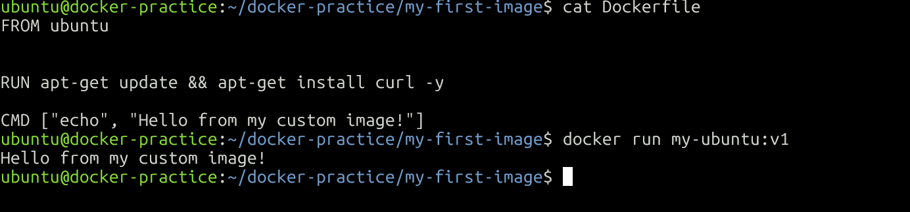
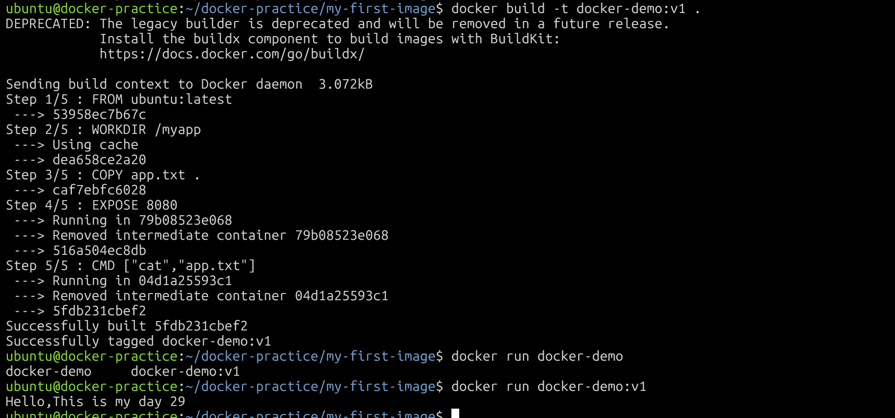
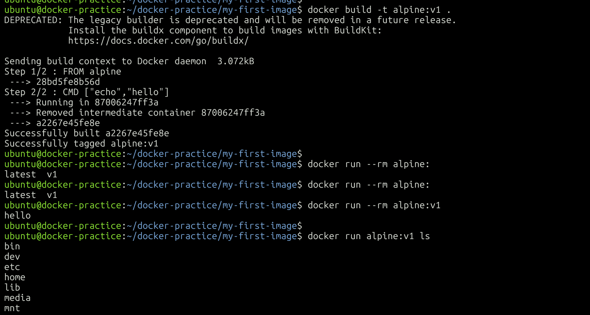
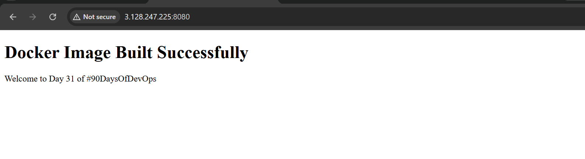
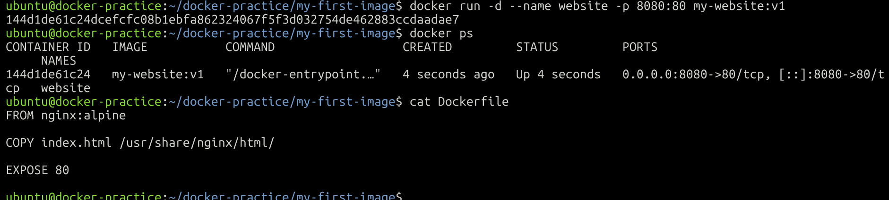
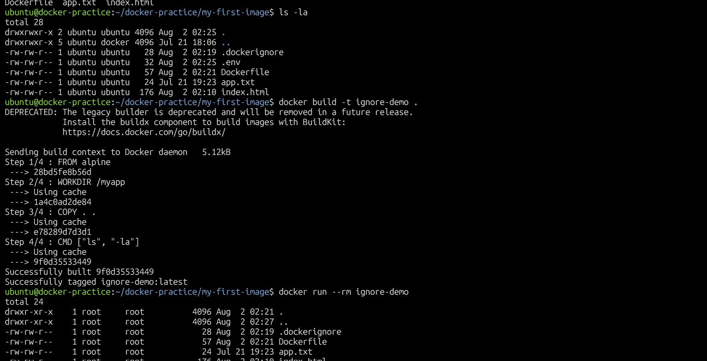
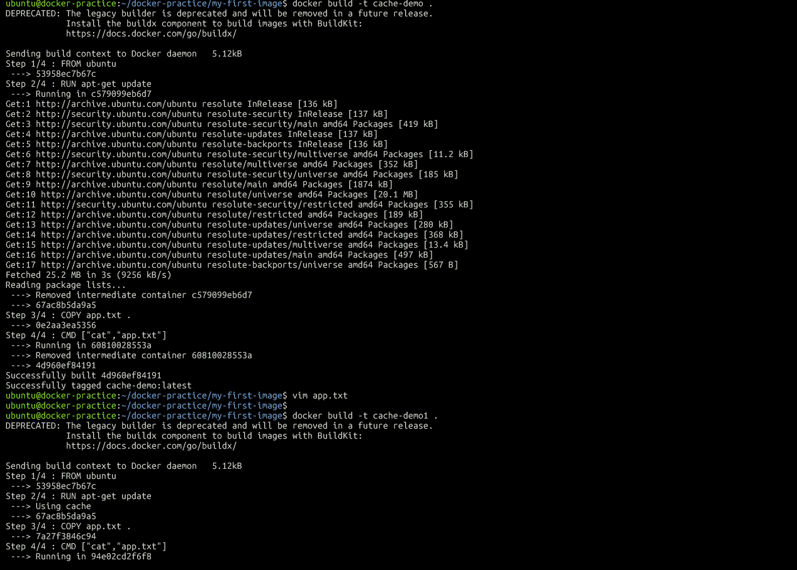

# Day 31 – Dockerfile: Build Your Own Images

## 📌 Objective

The goal of Day 31 was to understand how Docker images are built using **Dockerfiles**. I learned how to create custom images, use common Dockerfile instructions, compare **CMD vs ENTRYPOINT**, build a simple Nginx web application image, optimize builds using **.dockerignore**, and understand Docker layer caching.

---

# Task 1 – Your First Dockerfile

### Objective

Create a custom Docker image using Ubuntu as the base image.

### Dockerfile

```dockerfile
FROM ubuntu:latest

RUN apt-get update && \
    apt-get install -y curl

CMD ["echo", "Hello from my custom image!"]
```

### Build Image

```bash
docker build -t my-ubuntu:v1 .
```

### Run Container

```bash
docker run --rm my-ubuntu:v1
```

### Output

```
Hello from my custom image!
```

### Learning

- Created the first custom Docker image.
- Installed packages during image build.
- Used **CMD** to define the default command executed when the container starts.

### Screenshot



---

# Task 2 – Dockerfile Instructions

### Objective

Understand the purpose of commonly used Dockerfile instructions.

### Dockerfile

```dockerfile
FROM ubuntu:latest

RUN apt-get update && apt-get install -y curl

WORKDIR /app

COPY app.txt .

EXPOSE 8080

CMD ["cat", "app.txt"]
```

### Dockerfile Instructions Used

| Instruction | Purpose |
|-------------|---------|
| FROM | Defines the base image |
| RUN | Executes commands while building the image |
| WORKDIR | Sets the default working directory |
| COPY | Copies files from host to image |
| EXPOSE | Documents the application port |
| CMD | Specifies the default command |

### Build

```bash
docker build -t docker-demo:v1 .
```

### Run

```bash
docker run --rm docker-demo:v1
```

### Learning

- Understood how each Dockerfile instruction contributes to building an image.
- Learned the difference between build-time and run-time instructions.

### Screenshot



---

# Task 3 – CMD vs ENTRYPOINT

## CMD Example

```dockerfile
FROM alpine

CMD ["echo", "hello"]
```

Run

```bash
docker run cmd-demo
```

Output

```
hello
```

Override CMD

```bash
docker run cmd-demo ls
```

CMD is replaced by the new command.

---

## ENTRYPOINT Example

```dockerfile
FROM alpine

ENTRYPOINT ["echo"]
```

Run

```bash
docker run entry-demo Hello Docker!
```

Output

```
Hello Docker!
```

ENTRYPOINT remains the executable and appends the provided arguments.

### CMD vs ENTRYPOINT

| CMD | ENTRYPOINT |
|------|------------|
| Default command | Default executable |
| Can be overridden | Arguments are appended |
| Flexible | Best for fixed executables |

### Learning

- Use **CMD** when providing a default command.
- Use **ENTRYPOINT** when the container should always execute the same application.

### Screenshot



---

# Task 4 – Build a Simple Web App Image

### index.html

```html
<!DOCTYPE html>
<html>
<head>
    <title>Day 31</title>
</head>
<body>

<h1>Docker Image Built Successfully 🚀</h1>

<p>Welcome to Day 31 of #90DaysOfDevOps</p>

</body>
</html>
```

### Dockerfile

```dockerfile
FROM nginx:alpine

COPY index.html /usr/share/nginx/html/

EXPOSE 80
```

### Build

```bash
docker build -t my-website:v1 .
```

### Run

```bash
docker run -d --name website -p 8080:80 my-website:v1
```

Open in browser

```
http://localhost:8080
```

### Learning

- Built a custom Nginx image.
- Served a static HTML page from a Docker container.
- Understood how COPY places application files inside an image.

### Screenshot – Docker Image



### Screenshot – Web Application



---

# Task 5 – .dockerignore

### .dockerignore

```
node_modules
.git
*.md
.env
```

### Benefits

- Reduces build context size.
- Prevents unnecessary files from being copied.
- Speeds up image builds.
- Keeps sensitive files out of Docker images.

### Build

```bash
docker build -t ignore-demo .
```

### Learning

Using **.dockerignore** improves build efficiency by excluding unnecessary files from the Docker build context.

### Screenshot



---

# Task 6 – Build Optimization (Docker Cache)

### Dockerfile Example

```dockerfile
FROM ubuntu

RUN apt-get update && \
    apt-get install -y curl

WORKDIR /app

COPY app.txt .

CMD ["cat", "app.txt"]
```

### Build

```bash
docker build -t cache-demo .
```

Modify **app.txt** and rebuild.

Docker reuses previous layers and rebuilds only the modified layer and those after it.

### Why Layer Order Matters

- Docker caches every layer.
- Unchanged layers are reused.
- Frequently changing files should be copied near the end.
- Installing packages first avoids unnecessary rebuilds.
- Proper Dockerfile ordering significantly improves build speed.

### Learning

Understanding Docker layer caching helps create faster and more efficient image builds.

### Screenshot



---

# Commands Used

```bash
docker build -t image:tag .
docker images
docker run image
docker run --rm image
docker run -d -p 8080:80 image
docker ps
docker stop <container>
docker rm <container>
```

---

# Key Takeaways

- Learned how Docker builds custom images using Dockerfiles.
- Practiced essential Dockerfile instructions.
- Understood the difference between CMD and ENTRYPOINT.
- Built and deployed a simple static website using Nginx.
- Used .dockerignore to optimize the build context.
- Learned how Docker layer caching improves build performance.
- Understood why Dockerfile instruction order matters.

---

# Conclusion

Day 31 focused on creating and optimizing Docker images. By writing Dockerfiles from scratch, experimenting with CMD and ENTRYPOINT, deploying a static website with Nginx, and exploring Docker layer caching, I gained a solid understanding of how production-ready Docker images are built efficiently.

--
