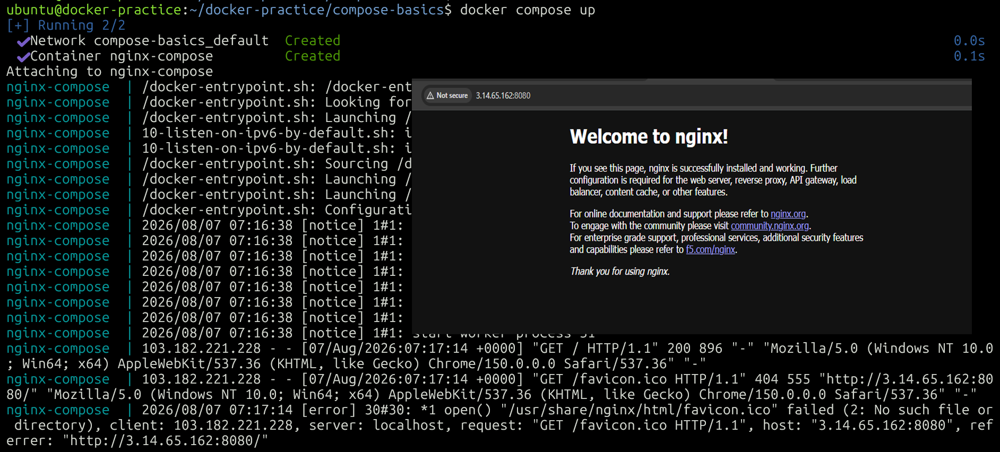
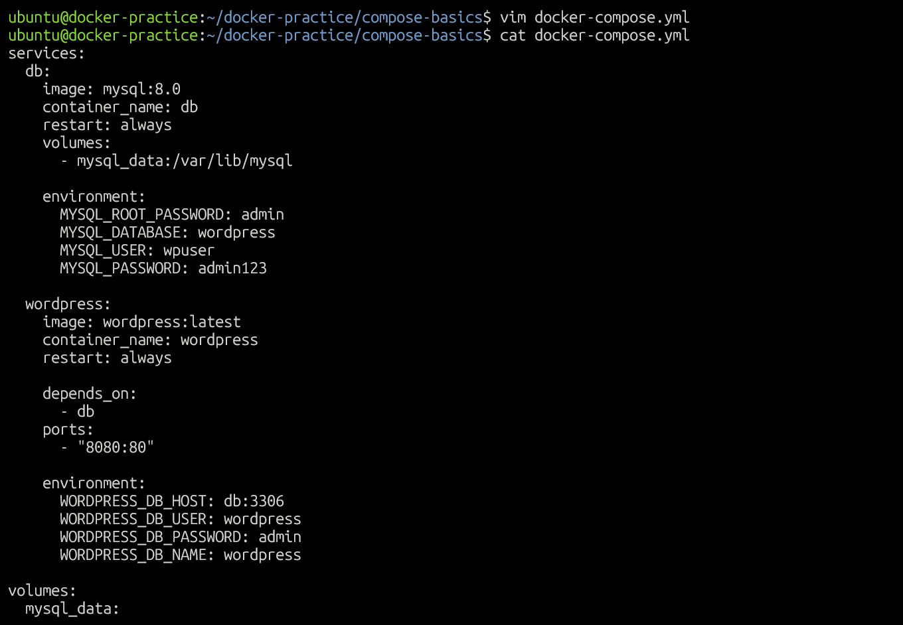
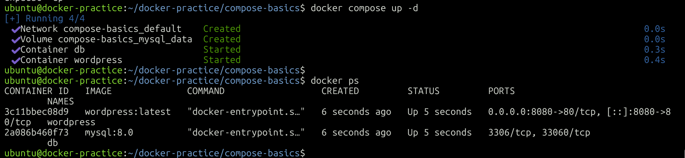
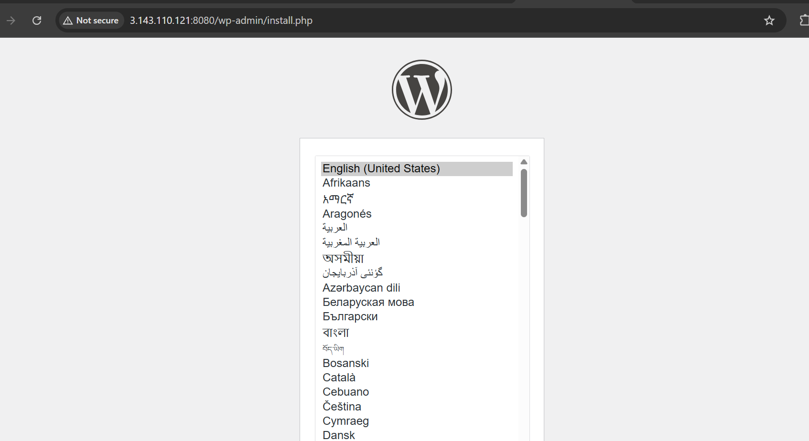
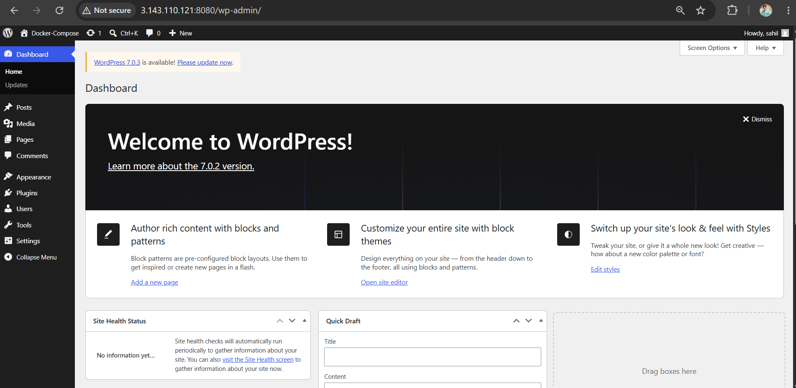
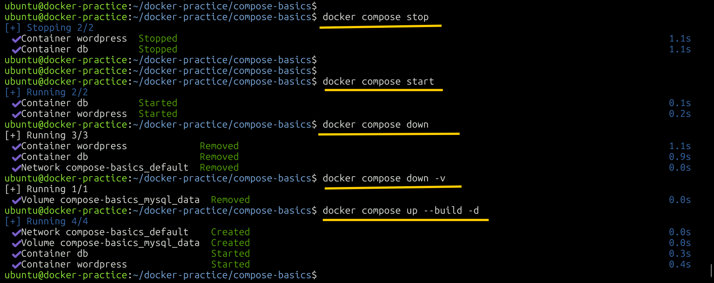
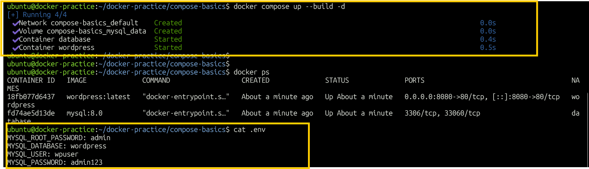
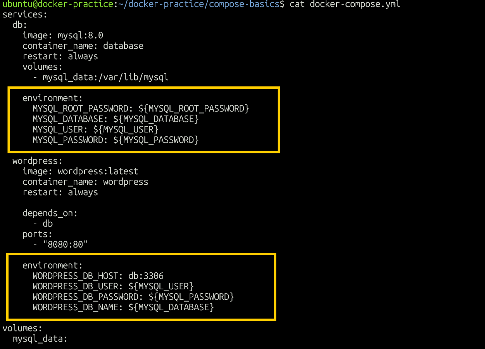

# Day 33 - Docker Compose: Multi-Container Basics

## Objective

Today's goal was to learn how to manage single and multi-container applications using Docker Compose.

Instead of manually creating containers, networks, and volumes one by one, Docker Compose allows us to define the complete application in a YAML file and manage it with simple commands.

---

# Task 1 - Install & Verify Docker Compose

## Check Docker Compose

```bash
docker compose version
```

This verifies whether Docker Compose is installed and available on the system.

---

# Task 2 - First Docker Compose Project

## Create Project Directory

```bash
mkdir compose-basics
cd compose-basics
```

## Create Docker Compose File

```bash
nano docker-compose.yml
```

Created a Compose file to run a single Nginx container.

```yaml
services:
  nginx:
    image: nginx:latest
    container_name: nginx-compose
    ports:
      - "8080:80"
```

## Start the Container

```bash
docker compose up
```

Or run in detached mode:

```bash
docker compose up -d
```

## Verify

```bash
docker compose ps
```

## Access Nginx

Open the following in the browser:

```text
http://<server-ip>:8080
```

### Screenshot



## Stop and Remove

```bash
docker compose down
```

---

# Task 3 - WordPress + MySQL Multi-Container Setup

The next step was to run WordPress and MySQL together using Docker Compose.

The application consists of two services:

- **WordPress** - Web application
- **MySQL** - Database

Docker Compose automatically creates a network so that both services can communicate with each other.

## WordPress + MySQL Compose File

```yaml
services:

  db:
    image: mysql:8.0
    container_name: mysql-compose

    environment:
      MYSQL_ROOT_PASSWORD: admin
      MYSQL_DATABASE: wordpress
      MYSQL_USER: wpuser
      MYSQL_PASSWORD: password123

    volumes:
      - mysql_data:/var/lib/mysql

  wordpress:
    image: wordpress:latest
    container_name: wordpress-compose

    depends_on:
      - db

    ports:
      - "8080:80"

    environment:
      WORDPRESS_DB_HOST: db:3306
      WORDPRESS_DB_USER: wpuser
      WORDPRESS_DB_PASSWORD: password123
      WORDPRESS_DB_NAME: wordpress

volumes:
  mysql_data:
    driver: local
```

## Important Configuration

### MySQL Root Password

```yaml
MYSQL_ROOT_PASSWORD: admin
```

Sets the root password for MySQL.

### MySQL Database

```yaml
MYSQL_DATABASE: wordpress
```

Creates a database named `wordpress`.

### MySQL User

```yaml
MYSQL_USER: wpuser
```

Creates a MySQL user named `wpuser`.

### MySQL Password

```yaml
MYSQL_PASSWORD: password123
```

Sets the password for the MySQL user.

### Named Volume

```yaml
volumes:
  - mysql_data:/var/lib/mysql
```

MySQL stores its database files inside:

```text
/var/lib/mysql
```

The named volume keeps the database data outside the container so that the data can survive container recreation.

### WordPress Database Host

```yaml
WORDPRESS_DB_HOST: db:3306
```

`db` is the Compose service name.

Docker Compose automatically provides DNS between services, so WordPress can reach MySQL using:

```text
db:3306
```

There is no need to manually find the MySQL container IP address.

### WordPress Database User

```yaml
WORDPRESS_DB_USER: wpuser
```

This must match:

```yaml
MYSQL_USER: wpuser
```

### WordPress Database Password

```yaml
WORDPRESS_DB_PASSWORD: password123
```

This must match:

```yaml
MYSQL_PASSWORD: password123
```

### WordPress Database Name

```yaml
WORDPRESS_DB_NAME: wordpress
```

This must match:

```yaml
MYSQL_DATABASE: wordpress
```

## Start the Application

```bash
docker compose up -d
```

## Check Running Containers

```bash
docker compose ps
```

### Screenshot - Compose File



### Screenshot - Two Container Setup



## Access WordPress

Open:

```text
http://<server-ip>:8080
```

Complete the WordPress installation.

### Screenshot - WordPress Setup



### Screenshot - WordPress Installed



---

## Verify Data Persistence

Stop and remove the containers:

```bash
docker compose down
```

Start them again:

```bash
docker compose up -d
```

Because MySQL uses the named volume:

```text
mysql_data
```

the database data remains available after the containers are recreated.

### Important

Do not use:

```bash
docker compose down -v
```

if you want to keep the database data.

The `-v` option removes the named volume.

---

# Task 4 - Docker Compose Commands

## 1. Start Services in Detached Mode

```bash
docker compose up -d
```

Runs the services in the background.

## 2. View Running Services

```bash
docker compose ps
```

Displays the containers managed by the current Compose project.

## 3. View Logs of All Services

```bash
docker compose logs
```

Follow logs continuously:

```bash
docker compose logs -f
```

## 4. View Logs of a Specific Service

For WordPress:

```bash
docker compose logs wordpress
```

For MySQL:

```bash
docker compose logs db
```

## 5. Stop Services Without Removing Them

```bash
docker compose stop
```

The containers are stopped but not removed.

Start them again:

```bash
docker compose start
```

## 6. Remove Everything

```bash
docker compose down
```

This removes the Compose containers and network.

To also remove volumes:

```bash
docker compose down -v
```

Use this carefully because removing the volume will delete the persisted MySQL data.

## 7. Rebuild Images

```bash
docker compose up --build
```

Or:

```bash
docker compose up --build -d
```

This is useful when changes are made to a Dockerfile or image build configuration.

### Screenshot



---

# Task 5 - Environment Variables

Environment variables allow configuration values to be separated from the main Compose file.

Instead of directly writing passwords and configuration values inside `docker-compose.yml`, they can be stored in a `.env` file.

## Create `.env`

```bash
nano .env
```

Add:

```env
MYSQL_ROOT_PASSWORD=root123
MYSQL_DATABASE=wordpress
MYSQL_USER=wpuser
MYSQL_PASSWORD=password123
WORDPRESS_PORT=8080
```

## docker-compose.yml

```yaml
services:

  db:
    image: mysql:8.0
    container_name: mysql-compose

    environment:
      MYSQL_ROOT_PASSWORD: ${MYSQL_ROOT_PASSWORD}
      MYSQL_DATABASE: ${MYSQL_DATABASE}
      MYSQL_USER: ${MYSQL_USER}
      MYSQL_PASSWORD: ${MYSQL_PASSWORD}

    volumes:
      - mysql_data:/var/lib/mysql

  wordpress:
    image: wordpress:latest
    container_name: wordpress-compose

    depends_on:
      - db

    ports:
      - "${WORDPRESS_PORT}:80"

    environment:
      WORDPRESS_DB_HOST: db:3306
      WORDPRESS_DB_USER: ${MYSQL_USER}
      WORDPRESS_DB_PASSWORD: ${MYSQL_PASSWORD}
      WORDPRESS_DB_NAME: ${MYSQL_DATABASE}

volumes:
  mysql_data:
    driver: local
```

## How Environment Variables Work

Docker Compose automatically reads the `.env` file when it is located in the Compose project directory.

For example:

```yaml
MYSQL_USER: ${MYSQL_USER}
```

gets its value from:

```env
MYSQL_USER=wpuser
```

So Docker Compose uses:

```yaml
MYSQL_USER: wpuser
```

Similarly:

```yaml
WORDPRESS_DB_PASSWORD: ${MYSQL_PASSWORD}
```

gets its value from:

```env
MYSQL_PASSWORD=password123
```

This allows both MySQL and WordPress to use the same database configuration without hardcoding the values multiple times.

## Why Use Environment Variables?

Environment variables help to:

- Separate configuration from application definitions
- Avoid repeating the same values
- Make configuration easier to change
- Keep passwords and other configuration values out of the Compose YAML file
- Make the Compose file reusable across different environments

## Verify Environment Variables

Run:

```bash
docker compose config
```

This shows the final Compose configuration after environment variables have been substituted.

> Be careful when using `docker compose config` because the resolved output can contain passwords. Do not upload this output publicly.

### Screenshot - Environment Variables



### Screenshot - Docker Compose with Environment Variables



---

# Protect the `.env` File

If the `.env` file contains real passwords or secrets, it should not be committed to GitHub.

Add it to `.gitignore`:

```gitignore
.env
```

Instead, create a `.env.example` file:

```env
MYSQL_ROOT_PASSWORD=your_root_password
MYSQL_DATABASE=wordpress
MYSQL_USER=wpuser
MYSQL_PASSWORD=your_password
WORDPRESS_PORT=8080
```

The `.env.example` file can safely be committed to GitHub because it does not contain real credentials.

---

# Important Docker Compose Commands

| Command | Purpose |
|---|---|
| `docker compose up` | Start services |
| `docker compose up -d` | Start services in detached mode |
| `docker compose down` | Stop and remove containers and network |
| `docker compose stop` | Stop containers without removing them |
| `docker compose start` | Start stopped containers |
| `docker compose ps` | View Compose services |
| `docker compose logs` | View logs |
| `docker compose logs -f` | Follow logs |
| `docker compose logs SERVICE` | View logs for a specific service |
| `docker compose config` | Validate and display resolved configuration |
| `docker compose up --build` | Rebuild and start services |
| `docker compose down -v` | Remove containers, networks, and volumes |

---

# Key Learnings

- Docker Compose allows multiple containers to be managed using one YAML file.
- Compose automatically creates a network for services.
- Service names work as DNS names between containers.
- WordPress can communicate with MySQL using the MySQL service name.
- Named volumes provide persistent database storage.
- `depends_on` controls the startup order of services.
- Environment variables make configuration easier to manage.
- `.env` files separate configuration values from the Compose YAML file.
- `docker compose config` can be used to verify the resolved configuration.
- `docker compose down -v` removes volumes and should be used carefully when persistent data is required.

---

# Conclusion

Docker Compose simplifies multi-container application management by allowing services, networking, storage, ports, and configuration to be defined in a single YAML file.

The WordPress + MySQL setup demonstrated how multiple containers can communicate through a Compose network while a named volume keeps database data persistent.

The environment variable exercise also demonstrated how configuration can be separated from the Compose file, making the setup easier to manage and reuse.

---

# Day 33 Completed

**Topics Covered:**

- Docker Compose
- Compose YAML
- Nginx with Compose
- Multi-container applications
- WordPress + MySQL
- Compose networking
- Service names and DNS
- Named volumes
- Data persistence
- Environment variables
- `.env` files
- Docker Compose logs
- Docker Compose lifecycle commands
```
