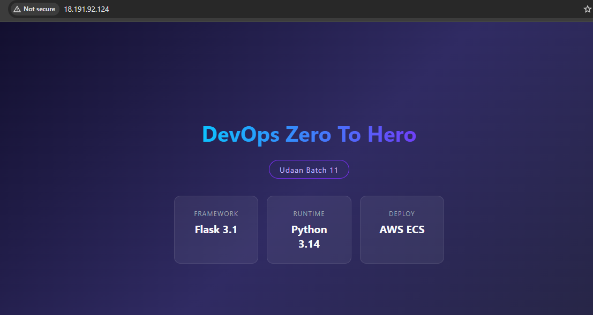
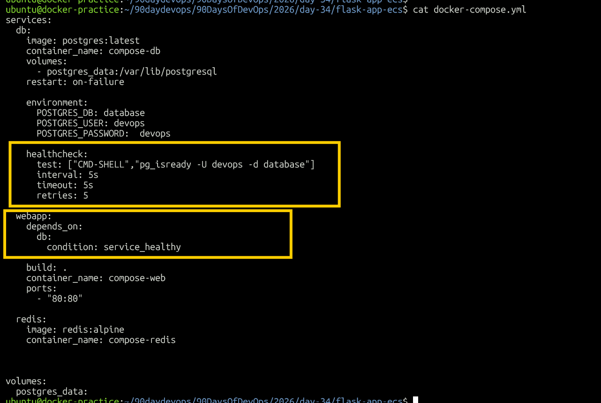
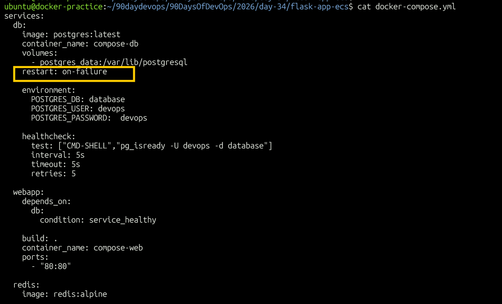
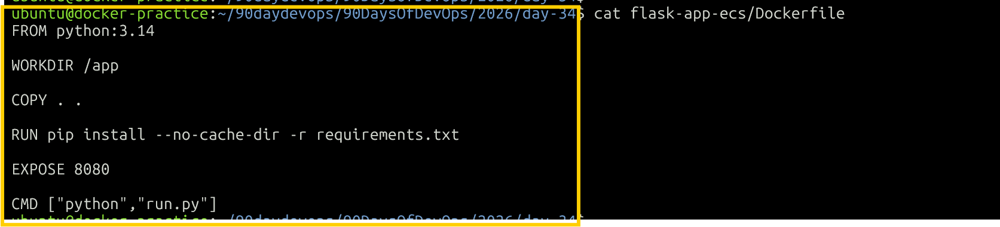
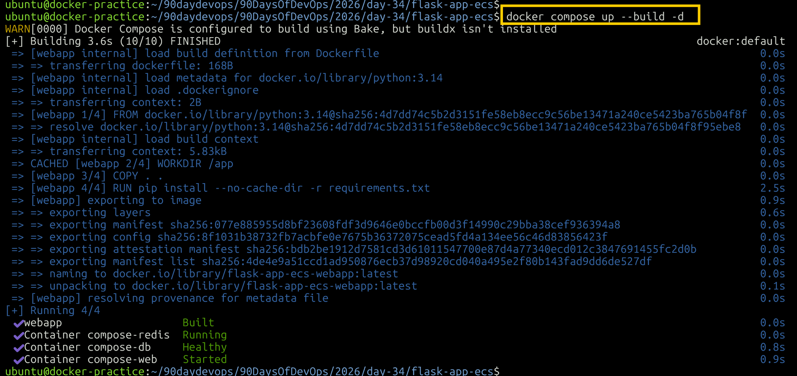
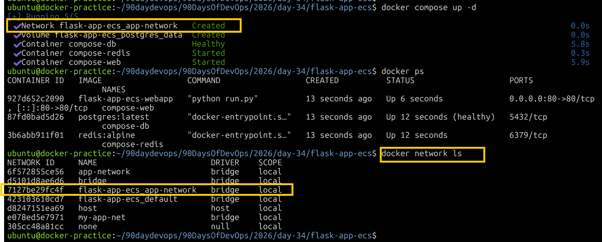
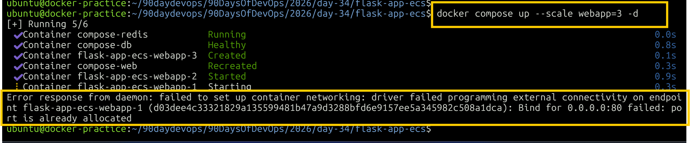

# Day 34 - Docker Compose: Real-World Multi-Container Apps

## Objective

Today's goal was to build a more realistic multi-container application using Docker Compose.

I worked with:

- Flask Web Application
- PostgreSQL Database
- Redis Cache
- `depends_on`
- Healthchecks
- Restart Policies
- Custom Dockerfile
- Named Volumes
- Custom Networks
- Labels
- Container Scaling

---

# Task 1 - Build Your Own App Stack

For this task, I used the existing Flask application from the TrainWithShubham repository instead of creating a new Flask application.

The existing application already contained:

- `Dockerfile`
- `app.py`
- `run.py`
- `requirements.txt`
- `templates/`

### Project Structure

```text
day-34/
├── README.md
├── day-34-compose-advanced.md
├── screenshots/
│   ├── Dockerfile.png
│   ├── docker-compose-for-3-service-stack.png
│   ├── helathchecks.png
│   ├── restart-policies.png
│   ├── rebuild-image.png
│   ├── network.png
│   ├── flask-app.png
│   └── scaling-error.png
└── flask-app-ecs/
    ├── Dockerfile
    ├── README.md
    ├── app.py
    ├── docker-compose.yml
    ├── requirements.txt
    ├── run.py
    └── templates/
```

---

## Step 1 - Flask Web Application

The existing Flask application was used as the web service.

The Compose service uses:

```yaml
webapp:
  build: .
  ports:
    - "80:80"
```

### `build: .`

The `.` means the current directory is used as the Docker build context.

Since the `docker-compose.yml` file is inside:

```text
flask-app-ecs/
```

Compose uses the Dockerfile from that directory.

---

## Step 2 - PostgreSQL Database

PostgreSQL was added using the official image:

```yaml
db:
  image: postgres:latest
```

The database was configured using environment variables:

```yaml
environment:
  POSTGRES_DB: database
  POSTGRES_USER: devops
  POSTGRES_PASSWORD: devops
```

---

## Step 3 - Redis Cache

Redis was added using the official Redis image:

```yaml
redis:
  image: redis:alpine
```

Redis provides an in-memory caching service for the application stack.

---

## Step 4 - Start the 3-Service Stack

Start all services:

```bash
docker compose up -d
```

Build the Flask image and start the stack:

```bash
docker compose up --build -d
```

Check running containers:

```bash
docker compose ps
```

Or:

```bash
docker ps
```

The stack contains:

```text
webapp
db
redis
```

### Screenshot


---

## Step 5 - Verify the Flask Application

The Flask application was exposed on port `80`.

Test locally:

```bash
curl http://localhost
```

The application was also verified from the browser.

### Screenshot



---

## Task 1 Observation

The three services were successfully managed using a single Docker Compose configuration.

```text
                Docker Compose
                     |
       +-------------+-------------+
       |             |             |
       v             v             v
    Flask App     PostgreSQL     Redis
     webapp           db          redis
       :80          :5432        :6379
```

---

# Task 2 - depends_on & Healthchecks

The next step was to make the web application wait for PostgreSQL to become ready.

---

## Step 1 - Add PostgreSQL Healthcheck

A healthcheck was added to the PostgreSQL service:

```yaml
healthcheck:
  test: ["CMD-SHELL", "pg_isready -U devops -d database"]
  interval: 5s
  timeout: 5s
  retries: 5
```

### What does `pg_isready` do?

```bash
pg_isready -U devops -d database
```

checks whether PostgreSQL is ready to accept connections for the specified database and user.

---

## Step 2 - Healthcheck Parameters

### `test`

```yaml
test: ["CMD-SHELL", "pg_isready -U devops -d database"]
```

The command Docker executes to determine whether PostgreSQL is healthy.

### `interval`

```yaml
interval: 5s
```

Docker performs the healthcheck every 5 seconds.

### `timeout`

```yaml
timeout: 5s
```

Docker waits up to 5 seconds for the healthcheck command to respond.

### `retries`

```yaml
retries: 5
```

Docker retries the healthcheck before marking the container as unhealthy.

---

## Step 3 - Check Health Status

Check the containers:

```bash
docker ps
```

PostgreSQL should eventually show:

```text
(healthy)
```

The health status can also be checked directly:

```bash
docker inspect compose-db --format='{{.State.Health.Status}}'
```

Expected:

```text
healthy
```

### Screenshot



---

## Step 4 - Add `depends_on`

The web application was configured to depend on PostgreSQL:

```yaml
depends_on:
  db:
    condition: service_healthy
```

This means Compose waits for PostgreSQL's healthcheck to become healthy before starting the web application.

---

## Startup Flow

```text
PostgreSQL starts
       |
       v
Healthcheck runs
       |
       v
PostgreSQL becomes healthy
       |
       v
Web application starts
```

---

## Step 5 - Test the Dependency

Stop the stack:

```bash
docker compose down
```

Start it again:

```bash
docker compose up
```

Check the service status:

```bash
docker compose ps
```

Check PostgreSQL health:

```bash
docker inspect compose-db --format='{{.State.Health.Status}}'
```

Expected:

```text
healthy
```

---

## Docker Compose Healthcheck vs Kubernetes Probes

Docker Compose provides:

```yaml
healthcheck:
```

Kubernetes provides separate probes:

- `livenessProbe` - checks whether the application is alive
- `readinessProbe` - checks whether the application is ready to receive traffic
- `startupProbe` - handles slow-starting applications

Docker Compose does not provide separate liveness, readiness, and startup probes like Kubernetes.

---

## Task 2 Observation

`depends_on` with:

```yaml
condition: service_healthy
```

is more useful than simply starting containers in order because the web application waits for PostgreSQL to pass its healthcheck.

---

# Task 3 - Restart Policies

Restart policies control what Docker should do when a container stops.

---

## Step 1 - `restart: always`

The PostgreSQL service was configured with:

```yaml
restart: always
```

This tells Docker to automatically restart the container when it exits.

This is useful for long-running services that are expected to remain available.

---

## Step 2 - Verify the Restart Policy

Check the configured policy:

```bash
docker inspect compose-db --format='{{json .HostConfig.RestartPolicy}}'
```

Expected output:

```text
{"Name":"always","MaximumRetryCount":0}
```

The restart policy was confirmed as:

```text
always
```

---

## Step 3 - Test Restart Behavior

Start the database:

```bash
docker start compose-db
```

Check:

```bash
docker ps
```

Stop the PostgreSQL process:

```bash
docker exec compose-db sh -c 'kill 1'
```

Wait a few seconds and check:

```bash
docker ps
```

Check the restart count:

```bash
docker inspect compose-db --format='RestartCount={{.RestartCount}}'
```

---

## Step 4 - Test `on-failure`

Change:

```yaml
restart: always
```

to:

```yaml
restart: on-failure
```

Recreate the stack:

```bash
docker compose down
docker compose up -d
```

Verify the policy:

```bash
docker inspect compose-db --format='{{.HostConfig.RestartPolicy.Name}}'
```

Expected:

```text
on-failure
```

---

## `on-failure` Behavior

`on-failure` restarts the container when the main process exits with a failure.

Conceptually:

```text
Process exits successfully
        |
        v
   No restart
```

```text
Process exits with failure
        |
        v
      Restart
```

---

## Restart Policy Comparison

| Policy | Behavior | Typical Use |
|---|---|---|
| `no` | Never restart automatically | Temporary containers and testing |
| `always` | Restart whenever the container stops | Long-running services |
| `on-failure` | Restart after a failed exit | Workers or processes that should recover from failures |
| `unless-stopped` | Restart unless explicitly stopped | Long-running services |

---

## When to Use Each Policy

### `no`

Use when the container should not restart automatically.

Example:

```yaml
restart: "no"
```

Useful for temporary containers, testing, or one-time jobs.

### `always`

Use for services that should continuously remain available.

Example:

```yaml
restart: always
```

Useful for long-running services such as databases or application services.

### `on-failure`

Use when the application should restart after an unexpected failure but should not restart after a successful exit.

Example:

```yaml
restart: on-failure
```

Useful for workers or processes where a successful exit is a valid outcome.

### `unless-stopped`

Use for long-running services that should restart automatically unless they have been explicitly stopped.

Example:

```yaml
restart: unless-stopped
```

---

## Screenshot



---

## Task 3 Observation

Restart policies provide automatic recovery behavior for containers.

The main difference is whether Docker restarts the container after a normal exit, a failure, or an explicit stop.

---

# Task 4 - Custom Dockerfiles in Compose

The Flask application already had its own Dockerfile.

The Dockerfile was used by Docker Compose to build the application image.

---

## Step 1 - Dockerfile

The existing Dockerfile contains:

```dockerfile
FROM python:3.14

WORKDIR /app

COPY . .

RUN pip install --no-cache-dir -r requirements.txt

EXPOSE 80

CMD ["python", "run.py"]
```

### Explanation

```dockerfile
FROM python:3.14
```

Uses Python 3.14 as the base image.

```dockerfile
WORKDIR /app
```

Sets `/app` as the working directory inside the container.

```dockerfile
COPY . .
```

Copies the Flask application files into the image.

```dockerfile
RUN pip install --no-cache-dir -r requirements.txt
```

Installs the Python dependencies.

```dockerfile
EXPOSE 80
```

Documents the port used by the application.

```dockerfile
CMD ["python", "run.py"]
```

Starts the Flask application.

### Screenshot



---

## Step 2 - Compose Build Configuration

The web application uses:

```yaml
webapp:
  build: .
```

The `.` means:

> Use the current directory as the Docker build context.

Because the Compose file is inside `flask-app-ecs`, Docker uses the Dockerfile from that directory.

---

## Step 3 - Build the Application

Run:

```bash
docker compose up --build -d
```

This:

1. Builds the application image.
2. Recreates containers when required.
3. Starts the services in detached mode.

---

## Step 4 - Make an Application Change

A small change was made to the existing Flask application.

The image was then rebuilt:

```bash
docker compose up --build -d
```

Check the containers:

```bash
docker compose ps
```

### Screenshot



---

## Task 4 Observation

Using:

```yaml
build: .
```

allows Docker Compose to build the application image directly from the project's Dockerfile.

The command:

```bash
docker compose up --build -d
```

is useful when Dockerfile or application changes need to be included in a new image.

---

# Task 5 - Named Networks & Volumes

---

## Step 1 - Named Volume

PostgreSQL was configured with a named volume:

```yaml
volumes:
  - postgres_data:/var/lib/postgresql/data
```

The named volume was declared at the bottom of the Compose file:

```yaml
volumes:
  postgres_data:
```

This allows PostgreSQL data to persist independently from the database container.

---

## Step 2 - Check Volumes

List Docker volumes:

```bash
docker volume ls
```

Inspect the volume:

```bash
docker volume inspect postgres_data
```

The volume stores PostgreSQL data outside the container's writable layer.

---

## Step 3 - Custom Network

An explicit network was created:

```yaml
networks:
  app-network:
    driver: bridge
```

The services were attached to this network:

```yaml
networks:
  - app-network
```

This provides a dedicated network for communication between the application services.

---

## Step 4 - Check Networks

List Docker networks:

```bash
docker network ls
```

Inspect the custom network:

```bash
docker network inspect app-network
```

The network contains the Compose services.

### Screenshot



---

## Step 5 - Service-to-Service Communication

Inside the Compose network, services can communicate using their service names.

For example:

```text
webapp -> db
webapp -> redis
```

The service name acts as the hostname.

Therefore, applications inside the Compose network can use:

```text
db
```

instead of the database container IP address.

Similarly:

```text
redis
```

can be used as the Redis hostname.

---

## Step 6 - Add Labels

Labels were added to organize Docker services.

### Web Application

```yaml
labels:
  project: "day-34"
  service: "webapp"
```

### PostgreSQL

```yaml
labels:
  project: "day-34"
  service: "database"
```

### Redis

```yaml
labels:
  project: "day-34"
  service: "cache"
```

Check labels:

```bash
docker inspect compose-web
```

---

## Task 5 Observation

Named volumes provide persistent database storage.

Custom networks provide controlled communication between services.

Labels provide metadata that can be used to identify and organize Docker resources.

---

# Task 6 - Scaling

Scaling was tested using Docker Compose:

```bash
docker compose up --scale webapp=3 -d
```

The goal was to run three replicas of the Flask web application.

---

## Step 1 - First Scaling Problem: `container_name`

Initially, the web application had:

```yaml
container_name: compose-web
```

When scaling was attempted:

```bash
docker compose up --scale webapp=3 -d
```

Docker Compose reported:

```text
The "webapp" service is using the custom container name "compose-web".
Docker requires each container to have a unique name.
```

### Why?

Three replicas cannot all have the same name:

```text
compose-web
compose-web
compose-web
```

Docker requires unique container names.

The following line was therefore removed from the `webapp` service:

```yaml
container_name: compose-web
```

---

## Step 2 - Scale Again

After removing the custom container name:

```bash
docker compose up --scale webapp=3 -d
```

Compose was able to create multiple web application containers.

The containers were named automatically, for example:

```text
flask-app-ecs-webapp-1
flask-app-ecs-webapp-2
flask-app-ecs-webapp-3
```

---

## Step 3 - Second Scaling Problem: Port Mapping

The next error was:

```text
Bind for 0.0.0.0:80 failed: port is already allocated
```

The reason is that the Compose service contains:

```yaml
ports:
  - "80:80"
```

This maps host port `80` to container port `80`.

When three replicas are created, Docker tries to do:

```text
Host Port 80
     |
     +---- webapp-1
     |
     +---- webapp-2
     |
     +---- webapp-3
```

The same host port cannot be bound to multiple containers.

### Screenshot



---

## Step 4 - Clean Up After Scaling Test

Remove the containers:

```bash
docker compose down
```

Start the normal single-instance stack again:

```bash
docker compose up -d
```

Verify:

```bash
docker compose ps
```

---

## Real-World Scaling Architecture

In a production-style setup, a reverse proxy or load balancer can expose port `80` and distribute traffic between multiple web replicas.

```text
                    Client
                      |
                      v
                Load Balancer
                    :80
                      |
          +-----------+-----------+
          |           |           |
          v           v           v
       webapp-1    webapp-2    webapp-3
          |           |           |
          +-----------+-----------+
                      |
                Internal Network
                      |
               +------+------+
               |             |
               v             v
           PostgreSQL       Redis
```

The load balancer owns the public port while the application replicas communicate through the internal network.

---

## Task 6 Observation

Two different problems were discovered while scaling:

1. A custom `container_name` prevents Compose from creating multiple replicas because every container would require a unique name.
2. A fixed host port such as `80:80` prevents multiple replicas from binding the same host port.

This demonstrates why a reverse proxy or load balancer is commonly placed in front of multiple application replicas.

---

# Useful Docker Compose Commands

## Start services

```bash
docker compose up -d
```

## Build and start

```bash
docker compose up --build -d
```

## Stop and remove containers

```bash
docker compose down
```

## View running services

```bash
docker compose ps
```

## View logs

```bash
docker compose logs
```

## Follow logs

```bash
docker compose logs -f
```

## View web application logs

```bash
docker compose logs webapp
```

## Validate Compose configuration

```bash
docker compose config
```

## List images

```bash
docker compose images
```

## Scale a service

```bash
docker compose up --scale webapp=3 -d
```

## List Docker networks

```bash
docker network ls
```

## Inspect Docker network

```bash
docker network inspect app-network
```

## List Docker volumes

```bash
docker volume ls
```

## Inspect PostgreSQL volume

```bash
docker volume inspect postgres_data
```

## Check PostgreSQL health

```bash
docker inspect compose-db --format='{{.State.Health.Status}}'
```

## Check restart policy

```bash
docker inspect compose-db --format='{{json .HostConfig.RestartPolicy}}'
```

## Check container restart count

```bash
docker inspect compose-db --format='RestartCount={{.RestartCount}}'
```

## Test Redis

```bash
docker exec -it compose-redis redis-cli ping
```

Expected:

```text
PONG
```

## Test the Flask application

```bash
curl http://localhost
```

---

# Final Architecture

```text
                         Docker Compose
                              |
              +---------------+---------------+
              |               |               |
              v               v               v
           Webapp          PostgreSQL       Redis
           Flask              DB            Cache
            :80              :5432          :6379
              |                |               |
              +----------------+---------------+
                              |
                        app-network
                              |
                        postgres_data
                           volume
```

---

# Key Learnings

- Docker Compose can manage multiple services as a single application stack.
- `build: .` allows Compose to build a custom application image using the Dockerfile in the current directory.
- Official images can be used for services such as PostgreSQL and Redis.
- `depends_on` controls service startup dependencies.
- `condition: service_healthy` allows a service to wait for a dependency's healthcheck.
- Docker Compose uses `healthcheck` instead of separate Kubernetes-style liveness, readiness, and startup probes.
- `restart: always` automatically restarts services according to the restart policy.
- `restart: on-failure` restarts containers after failed exits.
- Named volumes provide persistent storage for databases.
- Custom networks provide controlled communication between services.
- Compose service names can be used as hostnames for service-to-service communication.
- Labels provide metadata for organizing Docker resources.
- Custom `container_name` values can prevent service scaling.
- Fixed host port mappings prevent multiple replicas from binding the same host port.
- Load balancers or reverse proxies are commonly used to distribute traffic across application replicas.

---

# Final Verification

Validate the Compose configuration:

```bash
docker compose config
```

Check all services:

```bash
docker compose ps
```

Check images:

```bash
docker compose images
```

Check volumes:

```bash
docker volume ls
```

Check networks:

```bash
docker network ls
```

Check PostgreSQL health:

```bash
docker inspect compose-db --format='{{.State.Health.Status}}'
```

Expected:

```text
healthy
```

Test Redis:

```bash
docker exec -it compose-redis redis-cli ping
```

Expected:

```text
PONG
```

Test the Flask application:

```bash
curl http://localhost
```

---

# Conclusion

This exercise demonstrated how Docker Compose can be used to manage a realistic multi-container application.

The final stack included:

```text
Flask
PostgreSQL
Redis
```

along with:

```text
Healthchecks
depends_on
Restart Policies
Custom Dockerfile
Named Volume
Custom Network
Labels
Scaling
```

The scaling exercise also demonstrated two practical limitations:

- Custom container names prevent multiple replicas from being created.
- Fixed host port mappings prevent multiple replicas from binding the same host port.

These concepts are important when moving from simple Docker containers toward multi-container and production-style deployments.
