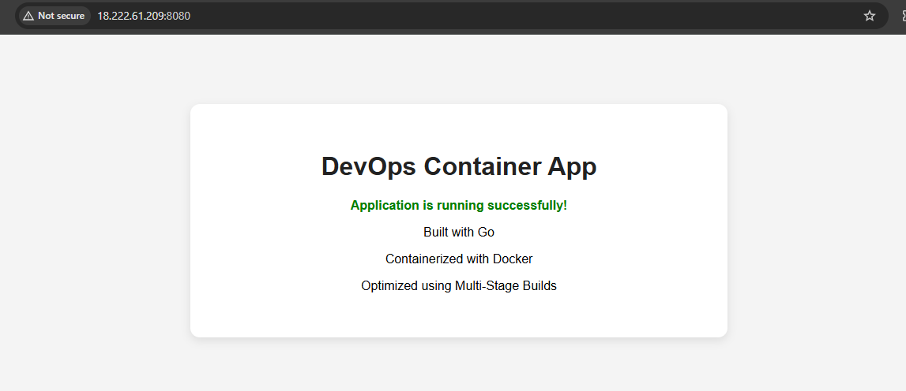
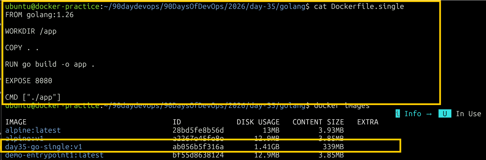
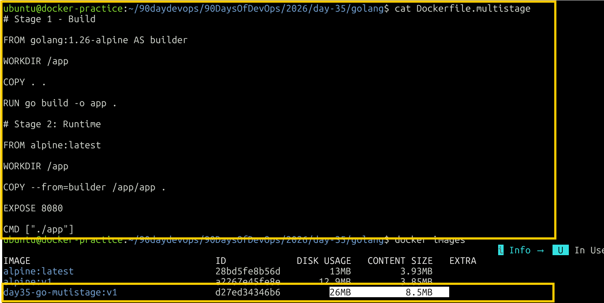
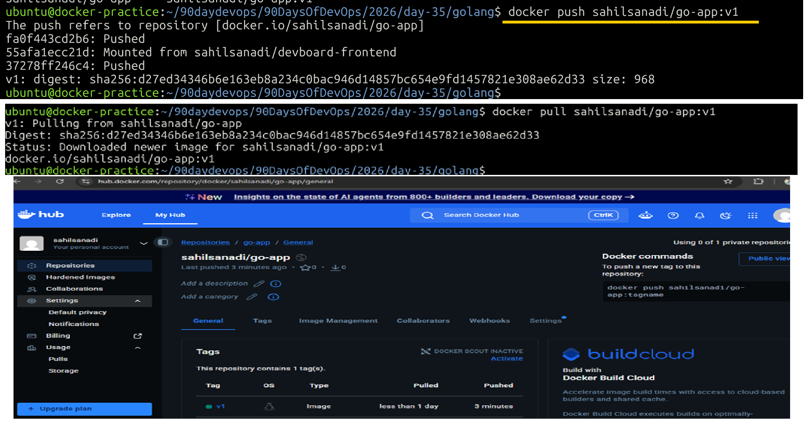
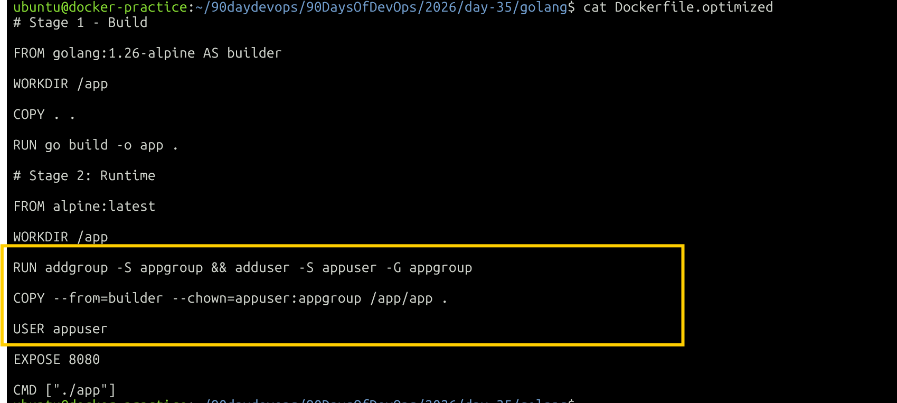

# Day 35 – Multi-Stage Builds & Docker Hub

## Objective

Today's goal was to build an optimized Docker image using a simple Go web application and publish the optimized image to Docker Hub.

---

# Project Structure

```text
day-35/
├── day-35-multistage-hub.md
└── screenshots/
        ├── golang-app.png
        ├── singlestage-dockerfile.png
        ├── multistage-dockerfile.png
        ├── task3-completion.png
        └── non-root-user.png
└── golang/
    ├── main.go
    ├── go.mod
    ├── Dockerfile.single
    ├── Dockerfile.multistage
    ├── Dockerfile.optimized
    
```

---

# Task 1 – The Problem with Large Images

## Step 1 – Go Application

Created a simple Go web application named:

`day35-go-app`

The application provides:

- A web page at `/`
- A health endpoint at `/health`

The application runs on:

`localhost:8080`

### Screenshot



---

## Step 2 – Go Module

Initialized the Go module:

```bash
go mod init day35-go-app
```

Updated the Go version:

```bash
go mod edit -go=1.26.0
```

Verified:

```bash
cat go.mod
```

---

## Step 3 – Test the Application

Started the application:

```bash
go run .
```

Tested the health endpoint:

```bash
curl http://localhost:8080/health
```

Expected:

```text
OK
```

The application was also verified through the browser.

---

## Step 4 – Single-Stage Dockerfile

Created:

`Dockerfile.single`

The Dockerfile uses the Go image to both build and run the application.

### Build the Image

```bash
docker build -f Dockerfile.single -t day35-go-single:1.0 .
```

### Check Image Size

```bash
docker images day35-go-single
```

### Result

**Single-stage image size: 1.41 GB**

The image contains the Go build environment and compiler along with the application.

### Screenshot



---

## Step 5 – Run the Single-Stage Container

```bash
docker run -d --name day35-go-single -p 8080:8080 day35-go-single:1.0
```

Check the container:

```bash
docker ps
```

Test the application:

```bash
curl http://localhost:8080/health
```

Expected:

```text
OK
```

Stop and remove the container:

```bash
docker stop day35-go-single
docker rm day35-go-single
```

---

# Task 2 – Multi-Stage Build

## Step 1 – Create Multi-Stage Dockerfile

Created:

`Dockerfile.multistage`

The Dockerfile uses two stages:

```text
Stage 1 → Build the Go application
Stage 2 → Run only the compiled application
```

The build artifact is copied from the builder stage using:

```dockerfile
COPY --from=builder
```

---

## Step 2 – Build the Multi-Stage Image

```bash
docker build -f Dockerfile.multistage -t day35-go-multistage:1.0 .
```

---

## Step 3 – Check Image Size

```bash
docker images day35-go-single day35-go-multistage
```

### Image Size Comparison

| Image | Size |
|---|---:|
| Single-stage | **1.41 GB** |
| Multi-stage | **26 MB** |

### Result

**1.41 GB → 26 MB**

Approximately **98.2% reduction**.

---

## Why Is the Multi-Stage Image Smaller?

The single-stage image contains the Go compiler and build environment.

The multi-stage build separates the build environment from the runtime environment.

```text
Build Stage
    ↓
Compile Go Application
    ↓
Compiled Binary
    ↓
COPY --from=builder
    ↓
Minimal Runtime Image
```

Only the compiled application is copied into the final runtime image.

The final image therefore does not contain the Go compiler or unnecessary build tools.

### Screenshot



---

## Step 4 – Test the Multi-Stage Image

```bash
docker run -d --name day35-go-multistage -p 8080:8080 day35-go-multistage:1.0
```

Check:

```bash
docker ps
```

Test:

```bash
curl http://localhost:8080/health
```

Expected:

```text
OK
```

Stop and remove:

```bash
docker stop day35-go-multistage
docker rm day35-go-multistage
```

---

# Task 3 – Push to Docker Hub

## Step 1 – Login

```bash
docker login
```

---

## Step 2 – Docker Hub Repository

Created the Docker Hub repository:

`sahilsanadi/go-app`

---

## Step 3 – Tag the Image

Tagged the multi-stage image:

```bash
docker tag day35-go-multistage:1.0 sahilsanadi/go-app:v1
```

Image:

`sahilsanadi/go-app:v1`

---

## Step 4 – Push the Image

```bash
docker push sahilsanadi/go-app:v1
```

The image was successfully pushed to Docker Hub with the `v1` tag.

---

## Step 5 – Pull and Verify the Image

Pulled the image again:

```bash
docker pull sahilsanadi/go-app:v1
```

Ran the pulled image:

```bash
docker run -d --name day35-go-hub -p 8080:8080 sahilsanadi/go-app:v1
```

Tested:

```bash
curl http://localhost:8080/health
```

Expected:

```text
OK
```

### Docker Hub Information

```text
Repository: sahilsanadi/go-app
Tag: v1
Platform: linux/amd64
Compressed size: 8.1 MB
```

> Docker Hub shows the compressed image size as 8.1 MB, while the local Docker image size is 26 MB.

### Screenshot



---

# Task 4 – Docker Hub Repository

## Repository Description

Added a repository description:

> Go web application demonstrating Docker multi-stage builds, image optimization, non-root execution, and Docker Hub distribution.

---

## Tags

The repository contains:

`v1`

Image reference:

`sahilsanadi/go-app:v1`

---

## Specific Tag vs `latest`

Specific version:

```bash
docker pull sahilsanadi/go-app:v1
```

This pulls the image tagged `v1`.

`latest` is a separate tag:

```bash
docker pull sahilsanadi/go-app:latest
```

It only works if a `latest` tag exists in the repository.

---

# Task 5 – Image Best Practices

## Step 1 – Optimized Dockerfile

Created:

`Dockerfile.optimized`

The optimized Dockerfile applies:

- Multi-stage build
- Minimal Alpine runtime
- Non-root user
- Specific image tags
- Combined related `RUN` commands
- Correct application ownership

---

## Step 2 – Minimal Base Image

Used:

`alpine:3.22`

as the runtime image.

This keeps the runtime environment lightweight.

---

## Step 3 – Non-Root User

Created a dedicated application user:

`appuser`

The container is configured to run using:

```dockerfile
USER appuser
```

---

## Step 4 – Specific Image Tags

Used specific versions instead of `latest`:

```text
golang:1.26-alpine
alpine:3.22
```

---

## Step 5 – Build the Optimized Image

```bash
docker build -f Dockerfile.optimized -t day35-go-optimized:v1 .
```

Check all image sizes:

```bash
docker images day35-go-single day35-go-multistage day35-go-optimized
```

### Final Comparison

| Image | Size |
|---|---:|
| Single-stage | **1.41 GB** |
| Multi-stage | **26 MB** |
| Optimized | **26 MB** |

The optimized image remained approximately **26 MB**.

This is expected because the major size reduction came from the multi-stage build. The additional best practices primarily improve **security and reproducibility** rather than reducing the image size further.

---

## Step 6 – Verify Non-Root User

```bash
docker run --rm day35-go-optimized:v1 id
```

The output confirmed that the container runs as the configured non-root user.

### Screenshot



---

## Step 7 – Test the Optimized Container

```bash
docker run -d --name day35-go-optimized -p 8080:8080 day35-go-optimized:v1
```

Test:

```bash
curl http://localhost:8080/health
```

Expected:

```text
OK
```

Stop and remove:

```bash
docker stop day35-go-optimized
docker rm day35-go-optimized
```

---

# Final Results

## Image Size Comparison

| Build | Size |
|---|---:|
| Single-stage | **1.41 GB** |
| Multi-stage | **26 MB** |
| Optimized | **26 MB** |
| Docker Hub compressed | **8.1 MB** |

### Size Reduction

**1.41 GB → 26 MB**

Approximately **98.2% reduction**.

> Docker Hub shows the compressed image size as 8.1 MB, while the local Docker image size is 26 MB.

---

# Docker Hub

## Repository

`sahilsanadi/go-app`

## Image

`sahilsanadi/go-app:v1`

## Repository URL

https://hub.docker.com/r/sahilsanadi/go-app

---

# Screenshots

The screenshots are stored under:

```text
golang/screenshots/
```

### Application


### Single-Stage Build


### Multi-Stage Build


### Docker Hub


### Non-Root Container


---

# Key Learnings

- Single-stage images can contain unnecessary build tools and compilers.
- Multi-stage builds separate the build environment from the runtime environment.
- `COPY --from=builder` allows only the required application artifact to be copied into the final image.
- Alpine provides a lightweight runtime image.
- Containers can be configured to run as a non-root user.
- Specific image tags provide more predictable builds than `latest`.
- Docker Hub tags can be used for image versioning.
- Docker Hub compressed image size differs from the local Docker image size.

---

# Useful Commands

## Go

```bash
go version
go mod init day35-go-app
go mod edit -go=1.26.0
go run .
gofmt -w main.go
```

## Build Images

```bash
docker build -f Dockerfile.single -t day35-go-single:1.0 .

docker build -f Dockerfile.multistage -t day35-go-multistage:1.0 .

docker build -f Dockerfile.optimized -t day35-go-optimized:v1 .
```

## Check Images

```bash
docker images
```

```bash
docker images day35-go-single day35-go-multistage day35-go-optimized
```

## Run Container

```bash
docker run -d --name CONTAINER_NAME -p 8080:8080 IMAGE_NAME
```

## Check Containers

```bash
docker ps
```

## Check Logs

```bash
docker logs CONTAINER_NAME
```

## Stop Container

```bash
docker stop CONTAINER_NAME
```

## Remove Container

```bash
docker rm CONTAINER_NAME
```

## Test Application

```bash
curl http://localhost:8080/health
```

## Docker Hub

```bash
docker login
```

```bash
docker tag day35-go-multistage:1.0 sahilsanadi/go-app:v1
```

```bash
docker push sahilsanadi/go-app:v1
```

```bash
docker pull sahilsanadi/go-app:v1
```

## Verify Non-Root User

```bash
docker run --rm day35-go-optimized:v1 id
```

---

# Submission Checklist

- [x] Created a simple Go application
- [x] Created a single-stage Dockerfile
- [x] Built the single-stage image
- [x] Recorded the single-stage image size
- [x] Created a multi-stage Dockerfile
- [x] Built the multi-stage image
- [x] Recorded the multi-stage image size
- [x] Compared image sizes
- [x] Explained why the multi-stage image is smaller
- [x] Logged in to Docker Hub
- [x] Tagged the image
- [x] Pushed the image to Docker Hub
- [x] Pulled the image from Docker Hub
- [x] Verified the pulled image
- [x] Added a Docker Hub repository description
- [x] Explored image tags
- [x] Tested a specific tag
- [x] Used a minimal base image
- [x] Added a non-root user
- [x] Used specific base-image tags
- [x] Rebuilt the optimized image
- [x] Verified the optimized image
- [x] Added screenshots
- [x] Added the Docker Hub repository link
- [x] Added the work to `2026/day-35/`
- [x] Committed and pushed the work to GitHub

---

# Final Outcome

```text
Go Application
      ↓
Single-Stage Docker Build
      ↓
1.41 GB
      ↓
Multi-Stage Docker Build
      ↓
26 MB
      ↓
Docker Hub
      ↓
sahilsanadi/go-app:v1
```

**Result: approximately 98.2% reduction in local image size while maintaining a working Go application.**
