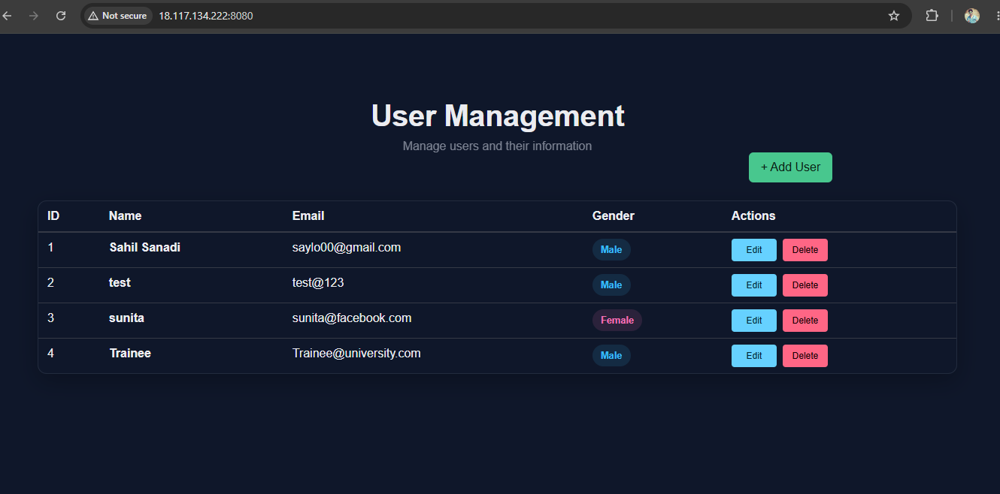

# Day 36 – Docker Project: Dockerize a Full Application

## Overview

Built and deployed a complete MERN Stack CRUD application using Docker.

The project demonstrates containerization of a frontend, backend, and MongoDB database using Docker Compose.

## Project

The complete Dockerized application is available in a separate repository:

**[MERN CRUD Dockerized](https://github.com/sahildevopss/mern-crud-dockerized/)**

## Technologies

- Docker
- Docker Compose
- Docker Hub
- Nginx
- React
- Node.js
- Express
- MongoDB
- AWS EC2

## Screenshots

### Frontend Application

### Frontend Dockerfile

### Backend Dockerfile

### Docker Compose

### Docker Hub Images

## Detailed Documentation

See [day-36-docker-project.md](day-36-docker-project.md) for the complete tasks, commands, implementation details, and answers.
