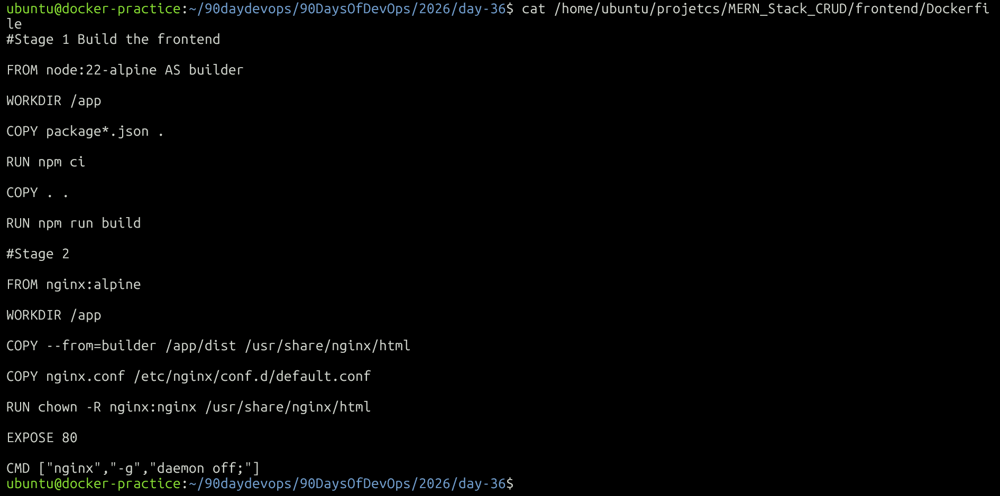
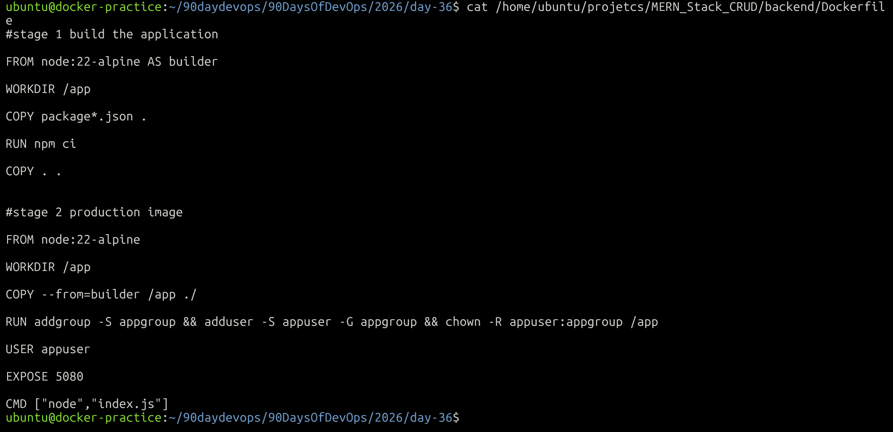
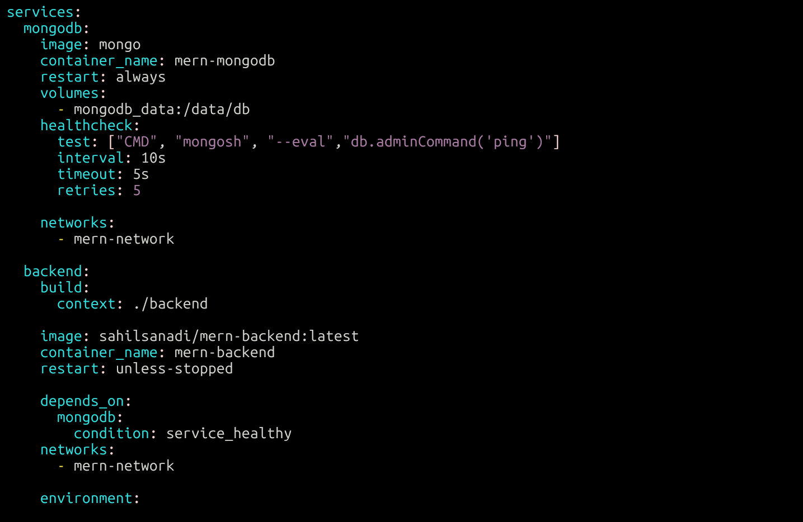
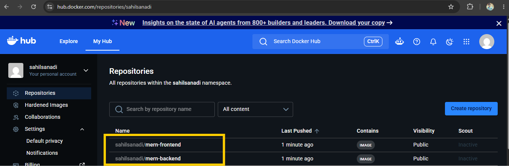

# Day 36 – Docker Project: Dockerize a Full Application

## Objective

Dockerize a complete MERN CRUD application using Docker and Docker Compose.

The application consists of:

- React frontend
- Node.js + Express backend
- MongoDB database
- Nginx
- Docker Compose
- Docker Hub

---

# Task 1 – Choose an Application

## Application

For this project, I used a MERN Stack CRUD application.

### Components

| Component | Technology |
|---|---|
| Frontend | React + Vite |
| Backend | Node.js + Express |
| Database | MongoDB |
| Web Server | Nginx |
| Containerization | Docker |
| Orchestration | Docker Compose |
| Registry | Docker Hub |

### Application Features

The application supports the following CRUD operations:

- Add User
- View Users
- Edit User
- Delete User

---

# Task 2 – Dockerize the Application

## Frontend Dockerfile

The frontend uses a multi-stage Docker build.

### `frontend/Dockerfile`

```dockerfile
# Stage 1 - Build the frontend

FROM node:22-alpine AS builder

WORKDIR /app

COPY package*.json .

RUN npm ci

COPY . .

RUN npm run build


# Stage 2 - Serve the production build

FROM nginx:alpine

WORKDIR /app

COPY --from=builder /app/dist /usr/share/nginx/html

RUN chown -R nginx:nginx /usr/share/nginx/html

EXPOSE 80

CMD ["nginx", "-g", "daemon off;"]
```

### Multi-Stage Build

The first stage uses Node.js to install dependencies and build the React application.

The second stage uses Nginx to serve the generated production files.

This keeps the final frontend image smaller because Node.js and the build environment are not required in the final image.

---
## Frontend Dockerfile




## Backend Dockerfile

The backend also uses a multi-stage Docker build.

### `backend/Dockerfile`

```dockerfile
# Stage 1 - Build the application

FROM node:22-alpine AS builder

WORKDIR /app

COPY package*.json .

RUN npm ci

COPY . .


# Stage 2 - Production image

FROM node:22-alpine

WORKDIR /app

COPY --from=builder /app ./

RUN addgroup -S appgroup && \
    adduser -S appuser -G appgroup && \
    chown -R appuser:appgroup /app

USER appuser

EXPOSE 5080

CMD ["node", "index.js"]
```
## Backend Dockerfile



### Backend Configuration

The backend application listens on port `5080`.

The backend container runs as a non-root user using:

```dockerfile
USER appuser
```

---

## `.dockerignore`

### Backend `.dockerignore`

```text
node_modules
npm-debug.log
.env
.git
.gitignore
Dockerfile
README.md
```

### Frontend `.dockerignore`

```text
node_modules
dist
.git
.gitignore
.env
README.md
```

The `.dockerignore` files prevent unnecessary files from being sent to the Docker build context.

---

# Task 3 – Docker Compose

The application is managed using Docker Compose.

### `docker-compose.yml`

```yaml
services:
  mongodb:
    image: mongo
    container_name: mern-mongodb
    restart: always

    volumes:
      - mongodb_data:/data/db

    healthcheck:
      test: ["CMD", "mongosh", "--eval", "db.adminCommand('ping')"]
      interval: 10s
      timeout: 5s
      retries: 5

    networks:
      - mern-network

  backend:
    build:
      context: ./backend

    image: sahilsanadi/mern-backend:latest
    container_name: mern-backend
    restart: unless-stopped

    depends_on:
      mongodb:
        condition: service_healthy

    networks:
      - mern-network

    environment:
      MONGO_URI: ${MONGO_URI}

  frontend:
    build:
      context: ./frontend

    image: sahilsanadi/mern-frontend:latest
    container_name: mern-frontend
    restart: unless-stopped

    depends_on:
      - backend

    ports:
      - "8080:80"

    networks:
      - mern-network

volumes:
  mongodb_data:

networks:
  mern-network:
```

## Docker Compose




## Docker Services

The Compose file contains three services:

### 1. MongoDB

```yaml
mongodb:
  image: mongo
```

MongoDB stores the application data.

### 2. Backend

```yaml
backend:
  image: sahilsanadi/mern-backend:latest
```

The backend runs the Node.js + Express API.

### 3. Frontend

```yaml
frontend:
  image: sahilsanadi/mern-frontend:latest
```

The frontend is served using Nginx.

---

## Docker Network

A custom Docker network is used:

```yaml
networks:
  - mern-network
```

This allows the containers to communicate using their Compose service names.

For example:

```text
backend → mongodb:27017
frontend/Nginx → backend:5080
```

---

## MongoDB Volume

MongoDB uses a named volume:

```yaml
volumes:
  - mongodb_data:/data/db
```

This provides persistent storage for MongoDB data.

The data remains available even if the MongoDB container is recreated.

---

## Environment Variable

The MongoDB connection string is passed to the backend through:

```yaml
environment:
  MONGO_URI: ${MONGO_URI}
```

Example `.env` value:

```env
MONGO_URI=mongodb://mongodb:27017/mern_curd
```

The `.env` file is excluded from the Docker image through `.dockerignore`.

---

## Port Configuration

### Frontend

```text
EC2 Host Port 8080 → Container Port 80
```

The frontend is accessed through:

```text
http://<EC2-PUBLIC-IP>:8080
```

### Backend

The backend listens internally on:

```text
5080
```

It is not publicly exposed through a host port.

Nginx communicates with the backend using:

```text
backend:5080
```

### MongoDB

MongoDB uses:

```text
27017
```

It is not publicly exposed.

---

# Task 4 – Build and Push Docker Images

## Build Images

The frontend and backend images were built using Docker Compose:

```bash
docker compose build --no-cache frontend backend
```

The resulting images were:

```text
sahilsanadi/mern-backend:latest
sahilsanadi/mern-frontend:latest
```

## Docker Images

### Backend

```text
Repository: sahilsanadi/mern-backend
Tag: latest
Size: 64.3 MB
```

### Frontend

```text
Repository: sahilsanadi/mern-frontend
Tag: latest
Size: 26.4 MB
```

---

## Push Backend Image

```bash
docker push sahilsanadi/mern-backend:latest
```

## Push Frontend Image

```bash
docker push sahilsanadi/mern-frontend:latest
```

Both images were successfully pushed to Docker Hub.

### Docker Hub Repositories

- `sahilsanadi/mern-backend`
- `sahilsanadi/mern-frontend`

---

## Docker Hub Images




# Task 5 – Deploy Using Docker Hub Images

To verify that the application could be deployed using the published images, the locally built frontend and backend images were removed.

The images were then downloaded from Docker Hub.

## Pull Images

```bash
docker compose pull frontend backend
```

This pulls the images defined in the Compose file:

```yaml
image: sahilsanadi/mern-backend:latest
```

and:

```yaml
image: sahilsanadi/mern-frontend:latest
```

## Start Containers Without Building

```bash
docker compose up -d --no-build
```

The `--no-build` option prevents Docker Compose from building the images from the local Dockerfiles.

The containers therefore run using the images pulled from Docker Hub.

---

# Task 6 – Verify the Application

Check the running containers:

```bash
docker compose ps
```

Expected services:

```text
mern-backend
mern-frontend
mern-mongodb
```

The frontend is exposed through:

```text
0.0.0.0:8080 → 80
```

The backend remains internal:

```text
5080/tcp
```

MongoDB remains internal:

```text
27017/tcp
```

---

## Application Verification

The following functionality was tested successfully:

- Frontend loads successfully
- Users can be viewed
- Users can be added
- Users can be edited
- Users can be deleted
- Backend connects to MongoDB
- MongoDB data persists using the Docker volume
- Frontend communicates with the backend through the Docker network
- Docker Hub images can be pulled successfully
- Application can run without rebuilding the images

---

# Final Result

The MERN application was successfully:

1. Dockerized
2. Configured with Docker Compose
3. Connected through a custom Docker network
4. Connected to MongoDB with persistent storage
5. Served through Nginx
6. Published to Docker Hub
7. Pulled from Docker Hub
8. Deployed without rebuilding the images
9. Tested successfully

## Final Architecture

```text
                         Internet
                            |
                            v
                     EC2 :8080
                            |
                            v
                    +---------------+
                    |     Nginx     |
                    |   Frontend    |
                    +-------+-------+
                            |
                    Docker Network
                            |
                            v
                    +---------------+
                    |    Backend    |
                    |    :5080      |
                    +-------+-------+
                            |
                            v
                    +---------------+
                    |    MongoDB    |
                    |    :27017     |
                    +-------+-------+
                            |
                            v
                    mongodb_data
```
