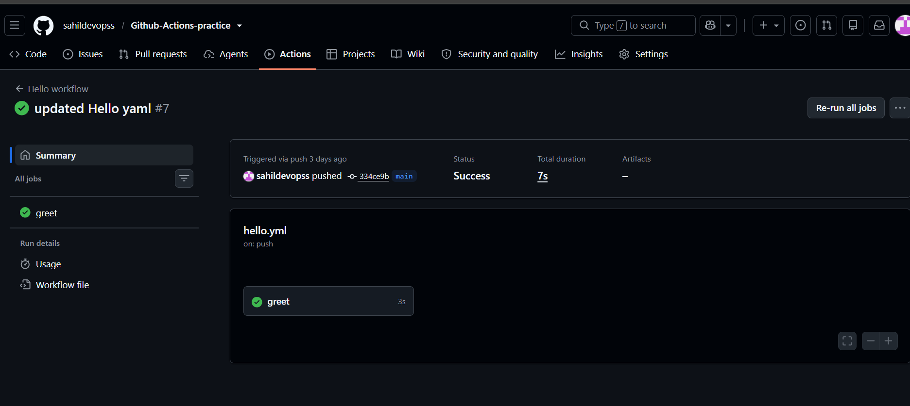
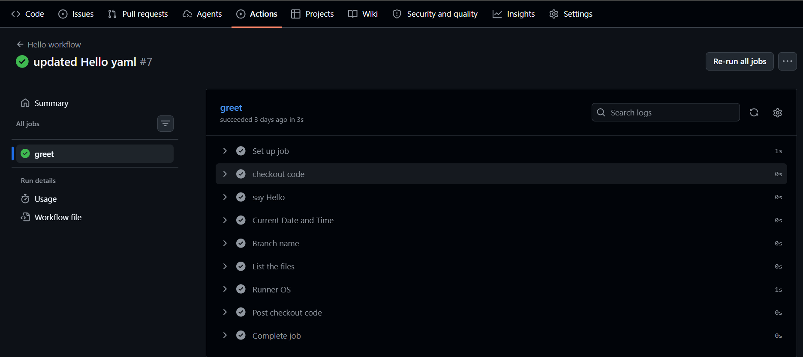
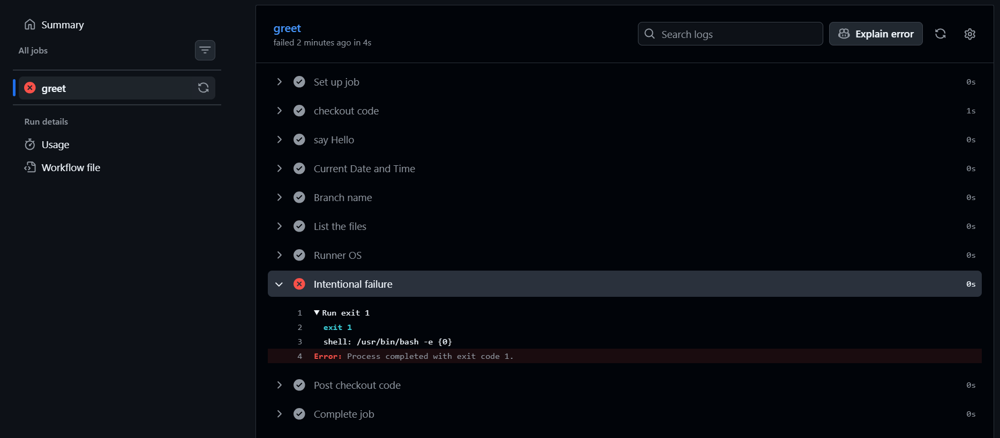

# Day 40 – Your First GitHub Actions Workflow

## Task
Today I created my first GitHub Actions pipeline and watched it run in the cloud.

The goal was to understand the basic structure of a GitHub Actions workflow, execute commands on a GitHub-hosted runner, intentionally break the pipeline, troubleshoot the failure, and verify the successful run after fixing it.

---

## Expected Output
- A workflow file: `.github/workflows/hello.yml`
- A markdown file: `day-40-first-workflow.md`
- Screenshot of the successful green pipeline run

---

# Challenge Tasks

## Task 1: Set Up

### Repository
Created a new public GitHub repository: `github-actions-practice`

Cloned the repository locally and created the required folder structure:
```text
.github/
└── workflows/
```

The workflow file was created at: `.github/workflows/hello.yml`

---

## Task 2: Hello Workflow

Created `.github/workflows/hello.yml` with a workflow that:
- Triggers on every push
- Contains one job called `greet`
- Runs on `ubuntu-latest`
- Checks out the repository code
- Prints `Hello from GitHub Actions!`

### Workflow YAML
```yaml
name: Hello workflow

on: push

jobs:
  greet:
    runs-on: ubuntu-latest

    steps:
      - name: checkout code
        uses: actions/checkout@v4

      - name: say Hello
        run: echo "Hello from GitHub Actions!"
```

### Explanation
- The workflow is triggered whenever I push code to the repository.
- The `greet` job runs on a GitHub-hosted Ubuntu runner.
- The first step uses `actions/checkout@v4` to check out the repository code onto the runner.
- The second step uses `run:` to execute the echo command and print: `Hello from GitHub Actions!`

### Verification
After pushing the workflow, I opened the Actions tab on GitHub and verified that the workflow completed successfully. The `greet` job and its steps showed green checkmarks.

### Successful Pipeline Run






---

## Task 3: Understand the Anatomy

* **`on:`** Defines the event that triggers the workflow (e.g., `on: push`).
* **`jobs:`** Groups all the jobs that run in the workflow. A single workflow can contain multiple jobs.
* **`runs-on:`** Specifies the operating system environment for the runner (e.g., `ubuntu-latest`).
* **`steps:`** Contains the linear sequence of individual tasks executed inside a job.
* **`uses:`** Tells the runner to pull and run an existing, reusable community or official GitHub Action (e.g., `actions/checkout@v4`).
* **`run:`** Executes a custom command-line instruction or script on the runner's shell.
* **`name:`** Provides a human-readable label displayed in the GitHub Actions UI dashboard.

---

## Task 4: Add More Steps

I updated `hello.yml` to perform additional tasks:
1. Print the current date and time
2. Print the branch name that triggered the workflow
3. List the files in the repository
4. Print the runner's operating system

### Updated Workflow
```yaml
name: Hello workflow

on: push

jobs:
  greet:
    runs-on: ubuntu-latest

    steps:
      - name: checkout code
        uses: actions/checkout@v4

      - name: say Hello
        run: echo "Hello from GitHub Actions!"

      - name: Current Date and Time
        run: date

      - name: Branch name
        run: echo "Branch: \${{ github.ref_name }}"

      - name: List the files
        run: ls -la

      - name: Runner OS
        run: echo "OS: \${{ runner.os }}"
```

### Step Breakdown
* **Date and Time:** `run: date` prints the runtime timestamp of the runner.
* **Branch Name:** Utilizing `${{ github.ref_name }}` extracts the contextual branch metadata dynamically.
* **List Files:** `run: ls -la` lists hidden files and directories in the working directory space to prove checkout worked.
* **Runner OS:** `${{ runner.os }}` explicitly references the host machine platform environment.

---

## Task 5: Break It On Purpose

To understand what happens when a pipeline fails, I intentionally added a command that returns a failure status.

### Intentional Failure Step
```yaml
      - name: Intentional Failure
        run: exit 1
```
The `exit 1` command returns a non-zero exit status, which GitHub Actions flags as a step failure.

### What Happened
- The workflow run failed globally.
- The `greet` job stopped processing further steps and flipped to a red X.
- Subsequent steps after the failure were automatically skipped.

### Failed pipeline



### How I Read the Error & Fixed It
1. Opened the **Actions** tab and drilled down into the specific failed run.
2. Clicked on the `greet` job to expand the workflow logs.
3. Identified `exit 1` as the explicit break point.
4. Removed the broken block from the local `.yml` file.
5. Pushed the cleaned configuration file back up to the main repository to trigger a clean run.

---

## Final Workflow
```yaml
name: Hello workflow

on: push

jobs:
  greet:
    runs-on: ubuntu-latest

    steps:
      - name: checkout code
        uses: actions/checkout@v4

      - name: say Hello
        run: echo "Hello from GitHub Actions!"

      - name: Current Date and Time
        run: date

      - name: Branch name
        run: echo "Branch: \${{ github.ref_name }}"

      - name: List the files
        run: ls -la

      - name: Runner OS
        run: echo "OS: \${{ runner.os }}"
```

---

## Key Takeaways
* Configuration files belong precisely within `.github/workflows/`.
* `exit` codes dictate automation status; non-zero values instantly stop step execution.
* Context variables like `${{ github.ref_name }}` allow for highly adaptive pipeline scripts.

## Result
Successfully completed my first GitHub Actions workflow layout!

