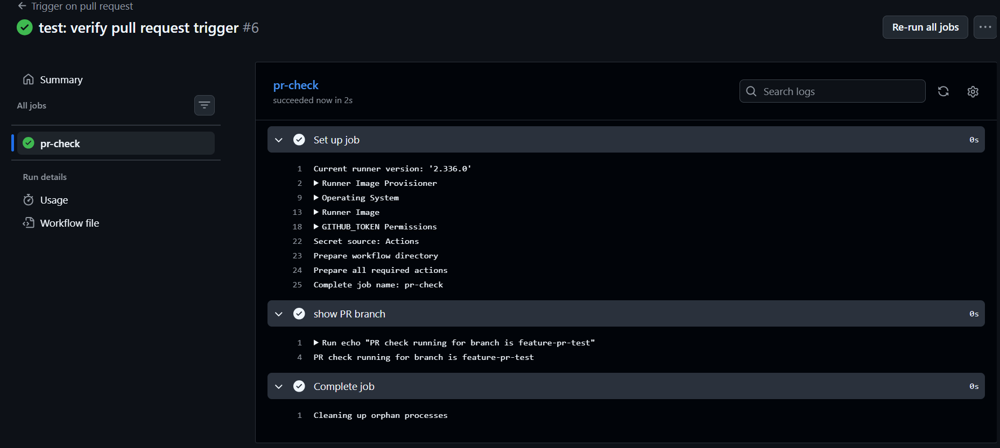
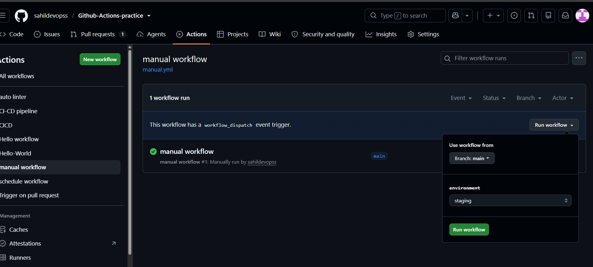
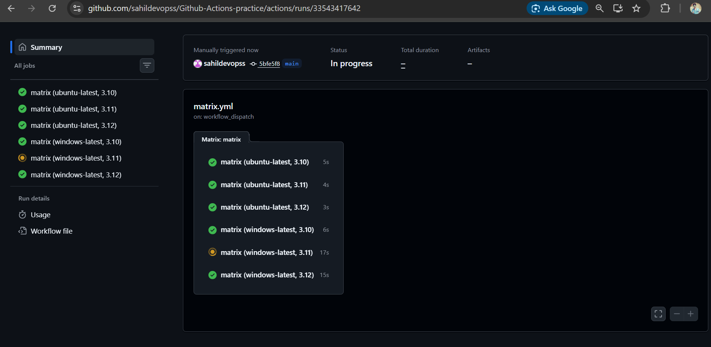
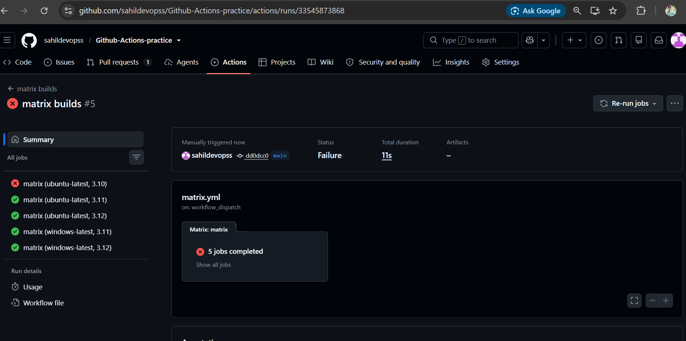

# Day 41 – Triggers & Matrix Builds

## Objective

Learn different ways to trigger GitHub Actions workflows and use matrix builds to run the same job across multiple environments.

---

# Task 1: Trigger on Pull Request

## Objective

Create a GitHub Actions workflow that runs when a pull request is opened or updated against the `main` branch.

## Workflow File

Create:

```text
.github/workflows/pr-check.yml
```

## Solution

```yaml
name: Trigger on pull request

on:
  pull_request:
    branches:
      - main
    types:
      - opened
      - synchronize

jobs:
  pr-check:
    runs-on: ubuntu-latest

    steps:
      - name: Show PR branch
        run: echo "PR check running for branch is ${{ github.head_ref }}"
```

## Steps

### 1. Create a Feature Branch

Created a feature branch:

```text
feature
```

### 2. Create the Workflow

Created:

```text
.github/workflows/pr-check.yml
```

The workflow was configured to trigger for pull requests targeting the `main` branch.

### 3. Configure Pull Request Events

The workflow uses:

```yaml
types:
  - opened
  - synchronize
```

- `opened` triggers when a new pull request is opened.
- `synchronize` triggers when new commits are pushed to the pull request branch.

### 4. Push the Workflow

```bash
git add .github/workflows/pr-check.yml
git commit -m "ci: add pull request trigger"
git push -u origin feature
```

### 5. Create the Pull Request

Created a pull request:

```text
feature → main
```

### 6. Verify the Workflow

The workflow successfully ran on the pull request.

Expected output:

```text
PR check running for branch is feature
```

## Issue Encountered

Initially, the workflow failed because of a YAML syntax error in the `run` command.

The problematic command was:

```yaml
run: echo "PR check running for branch: ${{ github.head_ref }}"
```

The colon followed by a space inside the unquoted YAML value caused a YAML parsing error.

The command was corrected to:

```yaml
run: echo "PR check running for branch is ${{ github.head_ref }}"
```

After pushing the correction, the workflow ran successfully.

## Key Learning

A `push` trigger and a `pull_request` trigger respond to different GitHub events.

The existing `hello.yml` workflow uses:

```yaml
on: push
```

so it runs whenever a commit is pushed.

The `pr-check.yml` workflow uses:

```yaml
on:
  pull_request:
```

so it runs when the configured pull request events occur.

## Screenshot



---

# Task 2: Scheduled Trigger

## Objective

Configure a GitHub Actions workflow to run automatically every day at midnight UTC using cron syntax.

## Workflow File

Create:

```text
.github/workflows/schedule.yml
```

## Solution

```yaml
name: schedule workflow

on:
  schedule:
    - cron: '0 0 * * *'

jobs:
  schedule-job:
    runs-on: ubuntu-latest

    steps:
      - name: Schedule
        run: echo "scheduled workflow is running"
```

## Steps

### 1. Create the Scheduled Workflow

Created:

```text
.github/workflows/schedule.yml
```

### 2. Configure the Cron Trigger

```yaml
on:
  schedule:
    - cron: '0 0 * * *'
```

The cron expression:

```text
0 0 * * *
```

means:

```text
Every day at 00:00 UTC
```

### 3. Commit and Push

```bash
git add .github/workflows/schedule.yml
git commit -m "ci: add scheduled workflow"
git push
```

## Cron Expression Answer

The cron expression for every Monday at 9 AM UTC is:

```text
0 9 * * 1
```

This means:

```text
Every Monday at 09:00 UTC
```

Since India uses IST:

```text
09:00 UTC = 14:30 IST
```

## Key Learning

GitHub Actions scheduled workflows use cron expressions.

GitHub Actions schedules are based on UTC, so the local time should be considered when configuring scheduled workflows.

## Screenshot


---

# Task 3: Manual Trigger

## Objective

Create a manually triggered workflow that accepts an environment input.

## Workflow File

Create:

```text
.github/workflows/manual.yml
```

## Solution

```yaml
name: Manual Workflow

on:
  workflow_dispatch:
    inputs:
      environment:
        description: "Environment name"
        required: true
        type: choice
        options:
          - staging
          - production

jobs:
  manual-job:
    runs-on: ubuntu-latest

    steps:
      - name: Show environment
        run: echo "Selected environment: ${{ inputs.environment }}"
```

## Steps

### 1. Create the Workflow

Created:

```text
.github/workflows/manual.yml
```

### 2. Configure the Manual Trigger

The workflow uses:

```yaml
workflow_dispatch:
```

This allows the workflow to be started manually from the GitHub Actions interface.

### 3. Add Environment Input

The workflow accepts two environment options:

```text
staging
production
```

### 4. Commit and Push

```bash
git add .github/workflows/manual.yml
git commit -m "ci: add manual workflow trigger"
git push
```

### 5. Run the Workflow Manually

Go to:

```text
GitHub → Actions → Manual Workflow → Run workflow
```

Select:

```text
staging
```

Expected output:

```text
Selected environment: staging
```

Run the workflow again with:

```text
production
```

Expected output:

```text
Selected environment: production
```

## Key Learning

The `workflow_dispatch` trigger allows a workflow to be started manually and can accept user-provided inputs.

## Screenshot



---

# Task 4: Matrix Builds

## Objective

Use a matrix strategy to run the same job across multiple Python versions.

## Workflow File

Create:

```text
.github/workflows/matrix.yml
```

## Solution

```yaml
name: Python Matrix Build

on:
  workflow_dispatch:

jobs:
  test:
    runs-on: ubuntu-latest

    strategy:
      matrix:
        python-version:
          - "3.10"
          - "3.11"
          - "3.12"

    steps:
      - name: Set up Python
        uses: actions/setup-python@v5
        with:
          python-version: ${{ matrix.python-version }}

      - name: Print Python version
        run: python --version
```

## Steps

### 1. Create the Matrix Workflow

Created:

```text
.github/workflows/matrix.yml
```

### 2. Configure Python Versions

The matrix contains:

```text
3.10
3.11
3.12
```

This creates three jobs.

### 3. Run the Workflow

Go to:

```text
GitHub → Actions → Python Matrix Build → Run workflow
```

The jobs should run independently and can execute in parallel.

## Expected Result

```text
test (3.10)
test (3.11)
test (3.12)
```

Each job installs its specified Python version and prints the version.

---

# Task 4 Extension: Multiple Operating Systems

## Objective

Extend the matrix to run across two operating systems and three Python versions.

## Solution

```yaml
name: Python Matrix Build

on:
  workflow_dispatch:

jobs:
  test:
    runs-on: ${{ matrix.os }}

    strategy:
      matrix:
        os:
          - ubuntu-latest
          - windows-latest

        python-version:
          - "3.10"
          - "3.11"
          - "3.12"

    steps:
      - name: Set up Python
        uses: actions/setup-python@v5
        with:
          python-version: ${{ matrix.python-version }}

      - name: Print Python version
        run: python --version
```

## Number of Jobs

There are:

```text
2 operating systems × 3 Python versions = 6 jobs
```

The six combinations are:

```text
Ubuntu + Python 3.10
Ubuntu + Python 3.11
Ubuntu + Python 3.12
Windows + Python 3.10
Windows + Python 3.11
Windows + Python 3.12
```

## Key Learning

A matrix automatically creates a job for every combination of the defined matrix values.

## Screenshot



---

# Task 5: Exclude & Fail-Fast

## Objective

Exclude one specific matrix combination and understand the difference between `fail-fast: true` and `fail-fast: false`.

---

## Part 1: Exclude a Combination

The combination to exclude is:

```text
Windows + Python 3.10
```

## Solution

```yaml
strategy:
  matrix:
    os:
      - ubuntu-latest
      - windows-latest

    python-version:
      - "3.10"
      - "3.11"
      - "3.12"

    exclude:
      - os: windows-latest
        python-version: "3.10"
```

## Number of Jobs After Exclusion

Before exclusion:

```text
2 operating systems × 3 Python versions = 6 jobs
```

After excluding one combination:

```text
6 - 1 = 5 jobs
```

The remaining combinations are:

```text
Ubuntu + Python 3.10
Ubuntu + Python 3.11
Ubuntu + Python 3.12
Windows + Python 3.11
Windows + Python 3.12
```

The following combination is excluded:

```text
Windows + Python 3.10
```

---

# Part 2: Fail-Fast

Set:

```yaml
fail-fast: false
```

The strategy becomes:

```yaml
strategy:
  fail-fast: false

  matrix:
    os:
      - ubuntu-latest
      - windows-latest

    python-version:
      - "3.10"
      - "3.11"
      - "3.12"

    exclude:
      - os: windows-latest
        python-version: "3.10"
```

## What Does `fail-fast: false` Do?

If one matrix job fails, the remaining matrix jobs continue running.

For example:

```text
Ubuntu + Python 3.10   FAILED
Ubuntu + Python 3.11   SUCCESS
Ubuntu + Python 3.12   SUCCESS
Windows + Python 3.11  SUCCESS
Windows + Python 3.12  SUCCESS
```

The overall workflow can still be marked as failed because one matrix job failed.

`fail-fast: false` only prevents GitHub from cancelling the remaining matrix jobs.

---

# Part 3: Test Matrix Failure

Temporarily add the following step:

```yaml
- name: Test failure
  if: matrix.python-version == '3.10' && matrix.os == 'ubuntu-latest'
  run: exit 1
```

This intentionally fails:

```text
Ubuntu + Python 3.10
```

The other matrix jobs should continue running because:

```yaml
fail-fast: false
```

After testing the behavior, remove the intentional failure step from the final workflow.

---

# `fail-fast: true` vs `false`

## `fail-fast: true`

`fail-fast: true` is the default.

When a matrix job fails, GitHub cancels other in-progress and queued matrix jobs.

## `fail-fast: false`

When a matrix job fails, GitHub allows the remaining matrix jobs to continue running.

## Comparison

| Setting | Behavior |
|---|---|
| `fail-fast: true` | Cancels remaining matrix jobs after a failure |
| `fail-fast: false` | Allows remaining matrix jobs to continue |

Neither setting makes a failed job successful.

## Screenshot



---

# Final Matrix Workflow

After completing Task 5, the final matrix workflow is:

```yaml
name: Python Matrix Build

on:
  workflow_dispatch:

jobs:
  test:
    runs-on: ${{ matrix.os }}

    strategy:
      fail-fast: false

      matrix:
        os:
          - ubuntu-latest
          - windows-latest

        python-version:
          - "3.10"
          - "3.11"
          - "3.12"

        exclude:
          - os: windows-latest
            python-version: "3.10"

    steps:
      - name: Set up Python
        uses: actions/setup-python@v5
        with:
          python-version: ${{ matrix.python-version }}

      - name: Print Python version
        run: python --version
```

---

# Summary

## GitHub Actions Triggers

### Push Trigger

```yaml
on: push
```

Runs when commits are pushed to the repository.

### Pull Request Trigger

```yaml
on:
  pull_request:
    branches:
      - main
```

Runs for configured pull request events targeting the `main` branch.

### Scheduled Trigger

```yaml
on:
  schedule:
    - cron: '0 0 * * *'
```

Runs according to the configured cron schedule.

### Manual Trigger

```yaml
on:
  workflow_dispatch:
```

Allows a workflow to be manually triggered from GitHub Actions.

---

# Matrix Concepts

## Matrix

A matrix runs the same job across multiple configurations.

## Multiple Matrix Dimensions

```text
2 operating systems × 3 Python versions = 6 jobs
```

## Exclude

The `exclude` option removes specific combinations from the matrix.

```yaml
exclude:
  - os: windows-latest
    python-version: "3.10"
```

This reduces the six combinations to five jobs.

## Fail-Fast

`fail-fast` controls what happens to the remaining matrix jobs when one job fails.

```yaml
fail-fast: false
```

allows the remaining jobs to continue.

---

# Screenshots

All screenshots are stored inside the `screenshots` directory.

```text
screenshots/
├── PR-workflow.png
├── schedule-workflow.png
├── manual-workflow.png
├── matrix-workflow.png
└── fail-fast.png
```

## Task 1: Pull Request Workflow


## Task 2: Scheduled Workflow


## Task 3: Manual Workflow


## Task 4: Matrix Workflow


## Task 5: Fail-Fast


---

# Day 41 Completed

- [x] Pull request trigger
- [x] Scheduled trigger
- [x] Manual trigger
- [x] Matrix builds
- [x] Multiple operating systems
- [x] Matrix exclusion
- [x] `fail-fast: false`
- [x] Tested matrix failure behavior
