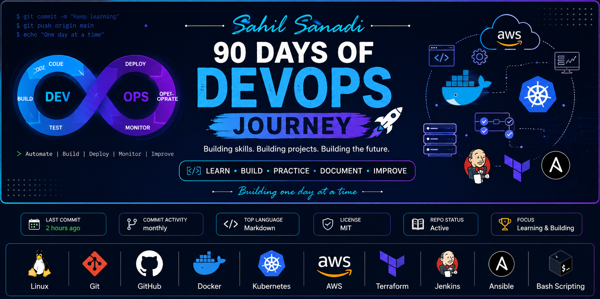

<p align="center">
  
</p>

# 90 Days of DevOps Journey

<p align="center">
  <strong>Learn • Build • Document • Improve</strong>
</p>

<p align="center">
  A hands-on journey to master DevOps through daily practice, real-world projects, and continuous learning.
</p>

---

<!-- 👇 Add badges here -->


<br>

<!-- 👇 Technology badges -->


---

# 👋 About This Repository

Welcome to my **90 Days of DevOps Journey**!

I'm documenting my daily learning experience as I transition into DevOps by focusing on practical implementation rather than just theory.

This repository contains my daily tasks, notes, commands, handwritten notes, diagrams, screenshots, and mini-projects completed throughout the challenge.

The goal is to build strong DevOps fundamentals while maintaining consistency and creating a portfolio that showcases my progress.

> **"Small improvements every day lead to big results."**

---

# 🎯 Objectives

- Build a strong foundation in DevOps
- Learn by doing hands-on practicals
- Document everything I learn
- Create reusable notes and cheat sheets
- Build a portfolio of real-world DevOps work
- Stay consistent throughout the journey

---

# 🛠️ Technologies Covered

- 🐧 Linux
- 📜 Shell Scripting
- 🌐 Networking
- 🔀 Git & GitHub
- 🐳 Docker
- ☸️ Kubernetes
- ☁️ AWS
- 🏗️ Terraform
- ⚙️ Jenkins
- 📦 Ansible
- 🔄 CI/CD
- 📊 Monitoring & Logging

---

# 📂 Repository Structure

```text
90DaysOfDevOps-Journey
│
├── README.md
│
└── 2026
    ├── Day-01
    ├── Day-02
    ├── Day-03
    ├── ...
    └── Day-90
```

Each day's folder may include:

- 📖 Notes
- 💻 Hands-on Labs
- 🖥️ Commands Used
- 📷 Screenshots
- 📝 Handwritten Notes
- 📊 Diagrams
- 💡 Key Learnings

---

# 📅 Journey Progress

- 📁 **Year:** 2026
- 🎯 **Challenge:** 90 Days of DevOps
- 🚀 **Status:** In Progress

> Daily progress is documented inside the `2026` folder. Each day's directory contains notes, commands, screenshots, diagrams, and hands-on implementations.

---

# 🌱 Why This Repository?

Learning DevOps isn't just about understanding tools—it's about solving real problems, automating workflows, and building reliable systems.

This repository serves as:

- My learning journal
- My DevOps portfolio
- A record of consistent daily progress
- A collection of practical notes for future reference

---

# 💡 Learning Approach

For every topic, I try to:

- Understand the concept
- Practice it in a lab environment
- Document the commands and observations
- Create notes for quick revision
- Share my progress publicly to stay accountable

---

# 📌 Inspiration

This journey is inspired by the **#90DaysOfDevOps** challenge by **TrainWithShubham**.

The learning, notes, documentation, implementations, and repository structure in this repository reflect my own understanding and hands-on practice throughout the challenge.

---

# 🤝 Connect With Me

### 💼 LinkedIn

> https://www.linkedin.com/in/sahil-sanadi-4a38b7119/

### 💻 GitHub

> https://github.com/sahildevopss

---

# ⭐ Support

If you find this repository helpful or interesting, consider giving it a ⭐.

It motivates me to continue learning, documenting, and sharing my DevOps journey.

---

<p align="center">
  🚀 Consistency over perfection. One day, one task, one step closer to becoming a better DevOps Engineer.
</p>
